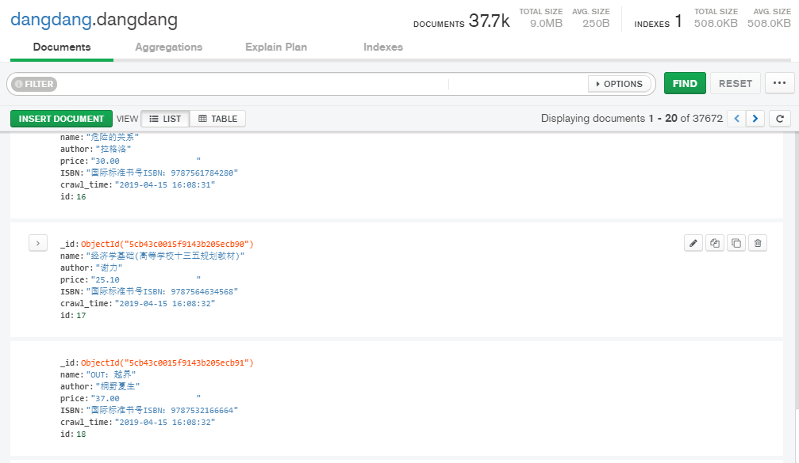

# DangDangBook
爬取当当网的图书条目，使用Scrapy-Redis实现一个分布式网络爬虫。

基于scrapy-redis做的分布式爬虫，可以解决单机爬虫的瓶颈。

数据库可以选择MongoDB或者MySQL。

### 运行
1. Master

   在项目中找到master_main.py文件，直接运行

2. Slave

   在项目中找到slave_main.py文件，直接运行

### 结果

