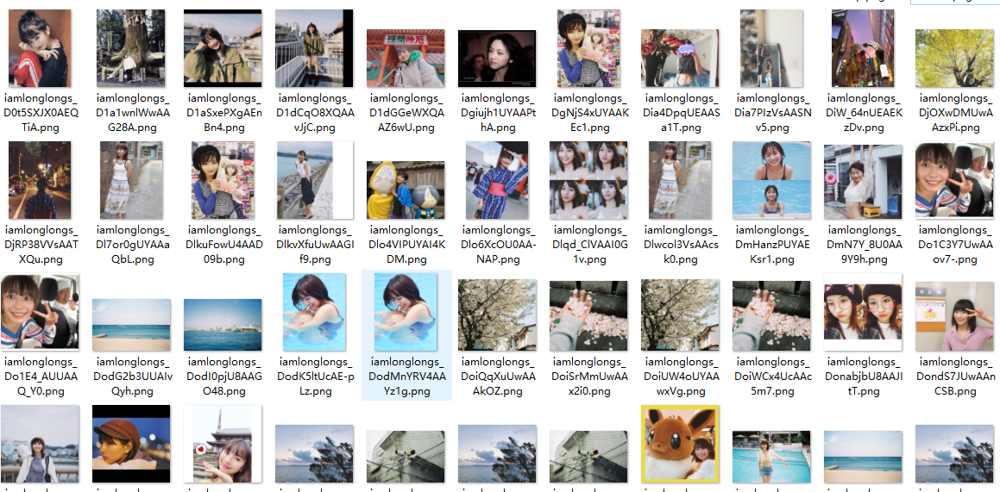

# Twitter 用户图片爬虫




    selenium
    urllib
    mysql


单个用户图片爬虫。
首先获取用户media下所有图片链接存入MySQL，然后下载每张图片。

配置文件内容：config.py

```python
# 待爬取用户名
lst_usernames = ['iamlonglongs']

# {1: '图片链接保存DB', 2: '下载图片'}
TYPE_DB_OR_IMG = 1

# 图片存储路径
PATH_IMGS = './imgs/'

# 代理
proxy_server = 'http://127.0.0.1:2080'

# 下载图片超时时间（s）
TIME_OUT = 20

# MySQL配置
host = '127.0.0.1'
user = 'root'
psd = '123456'
db = 'spiders'
c = 'utf8'
port = 3306
```

多进程下载图片：
执行 `pool_main.py`