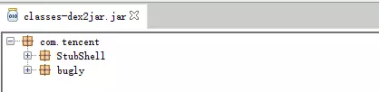
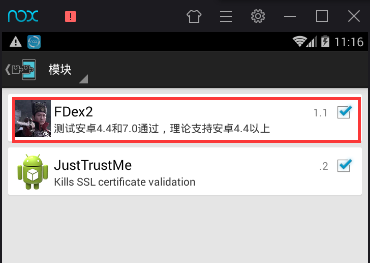
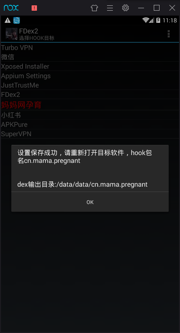
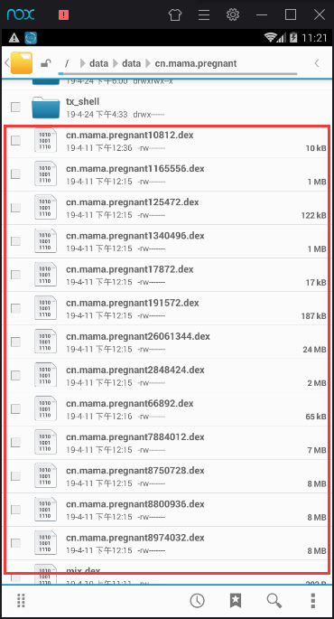
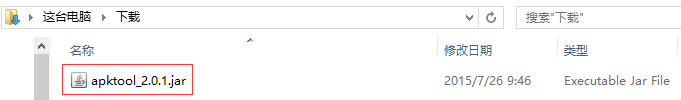
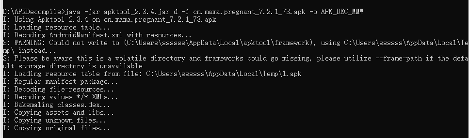
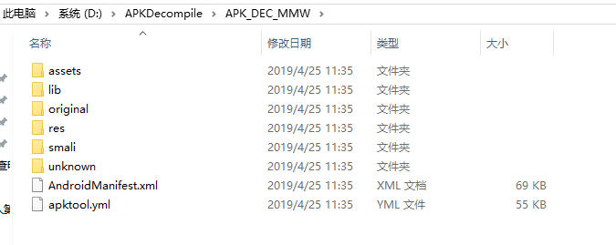
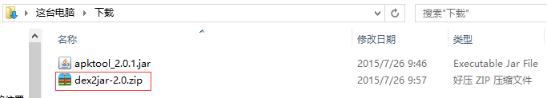
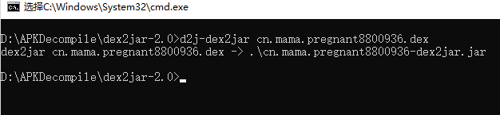
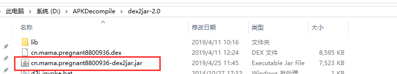

### 5.APK脱壳反编译

有时候，通过抓包工具分析app里面数据的请求url，可以得到请求的参数，如果能模拟请求url并设置参数，就可直接获取数据。但是一般请求参数里都有sign等加密参数，无法获得，通过反编译apk得到源码，如果能找到sign的加密方式，就可以自己模拟进行sign参数的发送，得到数据。

#### 5.1 脱壳：

为了不让APK那么容易被破解，所以就出现了加固工具，让反编译的难度更大。但是有了加固技术，就会有反加固技术，正所谓道高一尺魔高一丈。

如下图经过加固后的apk，通过常规方法反编译无法获取到源码。



##### 安装Xposed模块。

下载Xposed框架：打开手机浏览器，百度搜索xposed installer,点击下载。


Xposed框架是一款可以在不修改APK的情况下影响程序运行(修改系统)的框架服务，基于它可以制作出许多功能强大的模块，且在功能不冲突的情况下同时运作。当前，Per APP Setting(为每个应用设置单独的dpi或修改权限)、XPrivacy(防止隐私泄露)、对原生Launcher替换图标等应用或功能均基于此框架。


##### 脱壳工具FDex2

通过Hook ClassLoader的loadClass方法，反射调用getDex方法取得Dex(com.android.dex.Dex类对象)，在将里面的dex写出。

下载地址：

链接:<https://pan.baidu.com/s/1smxtinr> 密码:dk4v

安装好之后，启动xposed，在模块里面勾选FDex2工具进行激活，然后需要重启模拟器生效。



然后运行FDex2，可以看到模拟器所有app的列表，点击需要脱壳的应用，弹出如下界面：



然后，根据提示，重新打开运行目标APP，去dex输出目录寻找脱壳后的dex文件。如果没有生成对应的dex文件，可以多尝试几次。




#### 5.2 APK反编译：

https://blog.csdn.net/s13383754499/article/details/78914592

##### apktool ：

使用apktool反编译apk得到图片、XML配置、语言资源等文件。

apktool下载地址：<https://bitbucket.org/iBotPeaches/apktool/downloads>

下载好之后得到一个如下图所示的jar文件，版本可能不一样。




通过如下命令进行反编译：

```shell
java -jar apktool_2.0.1.jar d -f [PATH_APK] -o [PATH_OUT]
```



输出文件，可以看到apk的静态资源文件。



##### dex2jar：

dex2jar下载地址：<http://sourceforge.net/projects/dex2jar/files/>

下载完成之后，得到一个如下图所示的压缩包:



使用dex2jar反编译apk得到Java源代码，将要反编译的APK后缀名改为.rar或者 .zip，并解压，得到其中的classes.dex文件（它就是java文件编译再通过dx工具打包而成的）。

对于脱壳后的dex，保存到电脑，直接执行下面命令。由于有多个dex，不能确定哪一个是apk真正的源码，所以需要把每个dex都转换成jar包，然后分析代码才能知道。

```shell
d2j-dex2jar classes.dex
```



执行成功后可以看到输出的jar包，这样就可以看jar包的源码了。




#### 5.3 JAD-反编译class文件：

通过ide读取jar包的class源码，非常不方便，可以再对class文件进行反编译得到java文件。

```shell
jad -o -8 -r -d[PATH_OUT] -sjava [PATH_CLASS]
```

