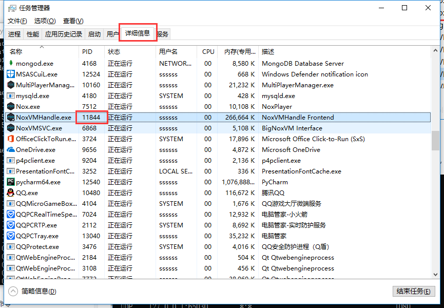
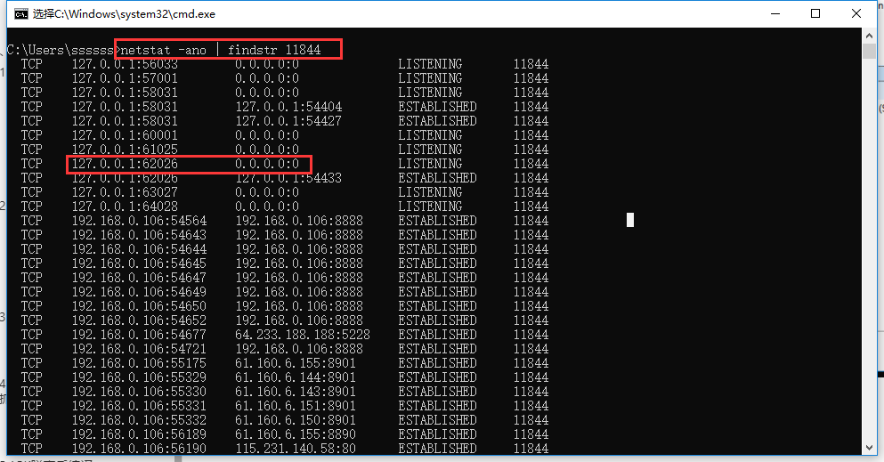
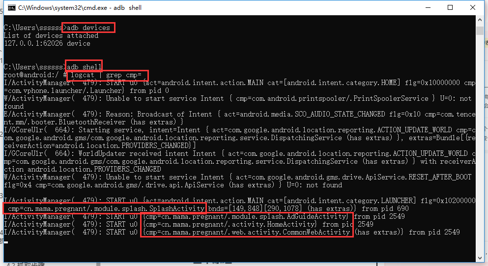
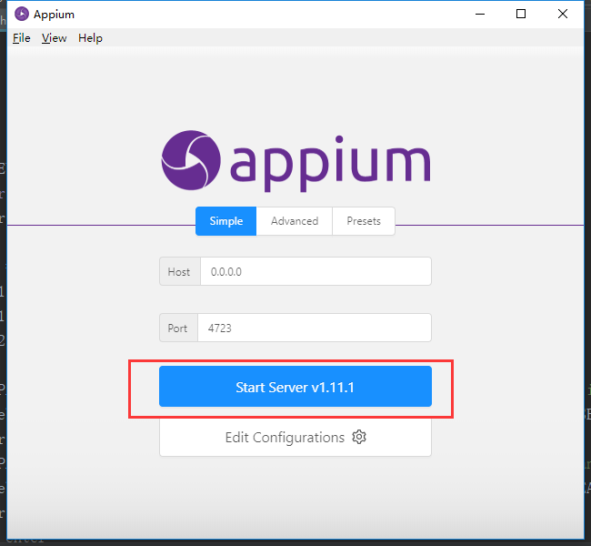
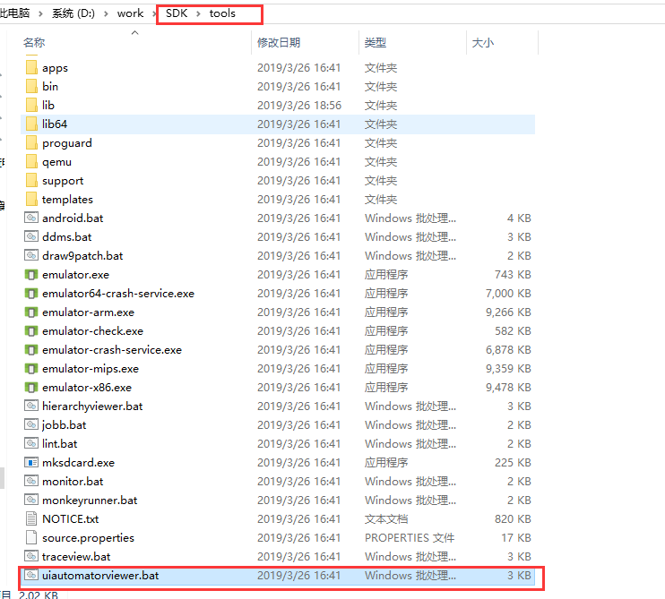
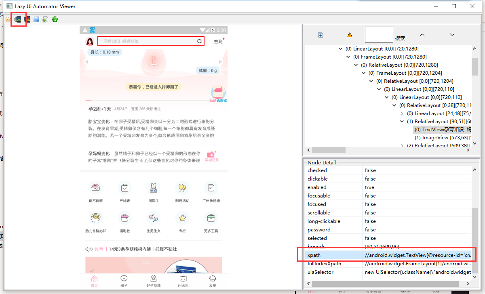

### 3.移动端自动化控制

#### 3.1 APK包名获取

通过adb方式来获取apk包名。首先确保adb服务已经启动并且连接上了模拟器。

启动adb服务：

```
adb start-server
```

通过adb devices方式查看连接上的模拟器。如果输入adb devices没有已连接的设备，则需要通过手动连接。

```
adb connect 127.0.0.1:62001
```

##### 端口号查看

打开任务管理器详细信息，找到模拟器的PID，如下图是夜神模拟器的运行PID。



然后通过`netstat -ano`命令找到对应端口。夜神模拟器的默认端口从62001开始，后面都是从62025开始



确认adb连接上设备之后，输入

```
adb shell
```

命令启动adb shell，然后输入如下命令：

```
logcat | grep cmp=
```

然后在模拟器中打开想要获取包名的app,就可以看到app的包名和页面的Activity了。




#### 3.2 Appium使用

appium的python包通过如下命令安装：

```
pip install Appium-Python-Client 
```

启动appium的服务



操作示例代码：

```python
import time
from appium import webdriver
from selenium.webdriver.support.ui import WebDriverWait

# 连接配置
cap = {
    "platformName": "Android",
    "platformVersion": "4.4.2",
    "deviceName": "127.0.0.1:62026",
    "appPackage": "cn.mama.pregnant",
    "appActivity": "cn.mama.pregnant.activity.HomeActivity",
    "noReset": True,
    "resetKeyboard": True,
    "unicodeKeyboard": True  # 中文支持！！！
}


# 获取屏幕大小
def get_size():
    x = driver.get_window_size()['width']
    y = driver.get_window_size()['height']
    return (x, y)


KEY_WORD = '纸尿裤'
print('APP启动中...')
# 启动连接
driver = webdriver.Remote("http://localhost:4723/wd/hub", cap)

l = get_size()
x1 = int(l[0] * 0.6)
y1 = int(l[1] * 0.9)
y2 = int(l[1] * 0.3)

# XPATH
XPATH_SEARCH = "//android.widget.TextView[@resource-id='cn.mama.pregnant:id/text_search_actionBar']"
WebDriverWait(driver, 10).until(lambda x: x.find_element_by_xpath(XPATH_SEARCH))  # 等待10s页面加载完成
driver.find_element_by_xpath(XPATH_SEARCH).click()  # 点击
XPATH_SEARCH_IN = "//android.widget.EditText[@resource-id='cn.mama.pregnant:id/input']"
WebDriverWait(driver, 2).until(lambda x: x.find_element_by_xpath(XPATH_SEARCH_IN))
driver.find_element_by_xpath(XPATH_SEARCH_IN).send_keys(KEY_WORD)  # 输入文字
time.sleep(1)
# enter搜索
driver.keyevent(66)

time.sleep(10)
while True:
    driver.swipe(x1, y1, x1, y2)  # 滑动屏幕
    print('滑动屏幕...')
    time.sleep(1)
```

其中Xpath的获取通过sdk的uiautomatorviewer工具获取。

##### uiautomatorviewer的使用



双击即可运行，点击左上角按钮即可获取模拟器页面，点击页面相应组件就可在右边获取到相应的xpath路径。




注意：appium服务在开启状态下uiautomatorviewer无法获取模拟器界面！

