### 1.环境安装

#### 1.1 模拟器安装

借助模拟器可以方便的进行调试开发APP，下载安装即可。

夜神模拟器：https://www.yeshen.com/

网易MuMu模拟器：http://mumu.163.com/


#### 1.2 SDK安装

下载地址：

（1）官网下载(需翻墙)：https://developer.android.com/studio/index.html 

（2）无需翻墙下载：http://www.androiddevtools.cn/

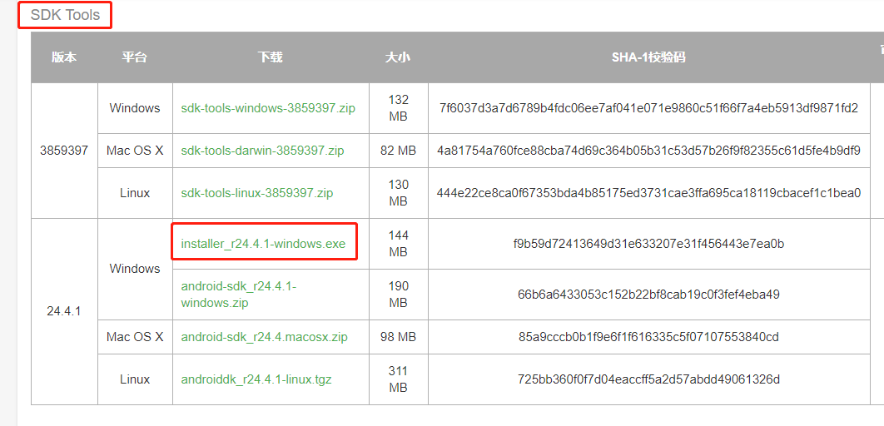

运行安装，得到如下目录：

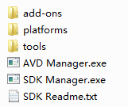

打开SDK Manager.exe


现在不需要配置镜像服务器地址了！

~~**配置国内的镜像服务器地址**~~

~~Android SDK Manager的主界面如下，从中可以看到许多的下载项，而该Android SDK Manager默认的下载项地址指向的是安卓官网的下载地址，在这种情况下，我们下载会出现及其卡顿的情况，甚至无法加载资源！所以说我们一般将其改成国内的下载源地址，修改方法如下，点击图示中的【Tools】，在弹出的下拉选项中选择【Options】~~

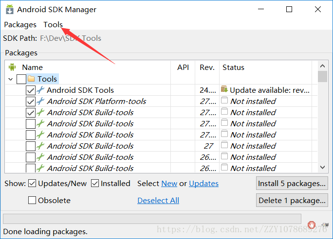

```
上海GDG镜像服务器
sdk.gdgshanghai.com   端口：8000 
大连东软信息学院镜像服务器地址
IPV4/IPV6：http://mirrors.neusoft.edu.cn  端口：80
```

~~在配置好镜像服务器地址之后，再勾选图示中的“Force …”选项，然后点击【close】~~


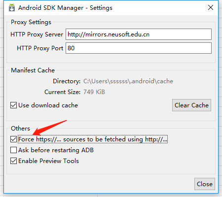


**选择要安装的工具**

并不是每一个软件都需要下载，而是有选择的，默认的情况下，该Android SDK Manager会包含以下三个下载项：

```
Android SDK Tools
Android SDK Platform-tools
Android SDK Build-tools
```

其中Build-tools是安卓SDK的构建工具，最少我们应该选择一个，其中该软件默认选择的是最新版的，当然我们在这里也可以同时选择多个。

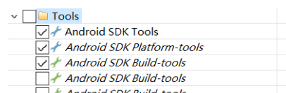

然后选择一个Android版本下载，而在选择所要下载的Android版本时，推荐选择下载与Build-tools对应的版本。

比如：

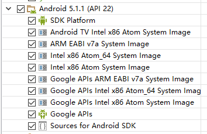

然后勾选Extras中的选项：

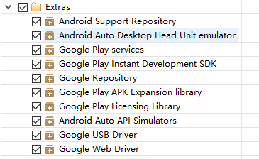

勾选完之后，直接点击【Install】选项安装。

注意：安装时间较长，可能持续数小时。


**配置环境变量**

ANDROID_HOME：配置sdk安装目录

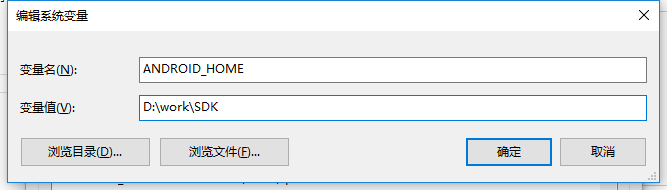

把%ANDROID_HOME%\platform-tools;%ANDROID_HOME%\tools添加到Path环境变量中。


**检测是否安装成功**

cmd中输入adb：

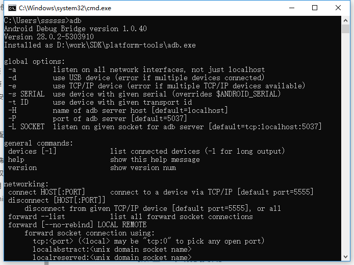


#### 1.3 Fiddler安装

Fiddler是一个http协议调试代理工具，它能够记录并检查所有你的电脑和互联网之间的http通讯，设置断点，查看所有的“进出”Fiddler的数据。 Fiddler 要比其他的网络调试器要更加简单，因为它不仅仅暴露http通讯还提供了一个用户友好的格式。

直接从官网下载安装：https://www.telerik.com/download/fiddler


#### 1.4 Appium安装

appium 是一个自动化测试开源工具，支持 iOS 平台和 Android 平台上的原生应用，web应用和混合应用。

appium类库封装了标准Selenium客户端类库，为用户提供所有常见的JSON格式selenium命令以及额外的移动设备控制相关的命令，如多点触控手势和屏幕朝向。

appium是跨平台的，可以用在OSX，Windows以及Linux桌面系统上运行。

appium选择了Client/Server的设计模式。只要client能够发送http请求给server，那么的话client用什么语言来实现都是可以的，这就是appium及Selenium(WebDriver)如何做到支持多语言的原因。


直接从官网下载安装：http://appium.io/


#### 1.5 mitmproxy库的安装

mitmproxy是一个支持HTTP和HTTPS的抓包程序，类似Fiddler、Charles的功能，只不过它通过控制台的形式操作。

此外，mitmproxy还有两个关联组件，一个是mitmdump，它是mitmproxy的命令行接口，利用它可以对接Python脚本，实现监听后的处理；另一个是mitmweb，它是一个Web程序，通过它以清楚地观察到mitmproxy捕获的请求。


安装：

```
pip install mitmproxy
```

通过pip方式可能会报错，建议通过下载whl文件方式进行安装。

下载地址：https://pypi.org/project/mitmproxy/#files

```
pip install mitmproxy-4.0.4-py3-none-any.whl
```


**证书配置**

对于mitmproxy来说，如果想要截获HTTPS请求，就需要设置证书。mitmproxy在安装后会提供一套CA证书，只要客户端信任了mitmproxy提供的证书，就可以通过mitmproxy获取HTTPS请求的具体内容，否则mitmproxy是无法解析HTTPS请求的。

首先，运行`mitmdump`命令产生CA证书。

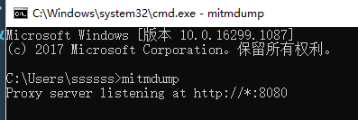

接下来，我们就可以在用户目录下的.mitmproxy目录里面找到CA证书

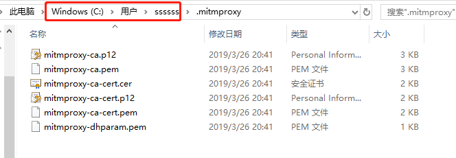

其中mitmproxy-ca.p12是用于windows的证书，双击即可出现证书导入页面，点击下一步即可完成安装。

mitmproxy-ca-cert.pem是用于手机端的安装，具体步骤后面介绍。