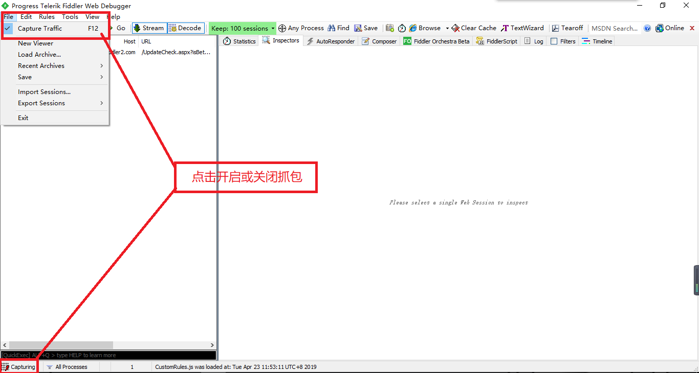
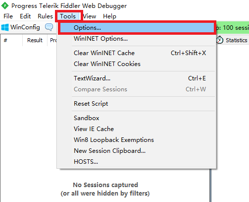
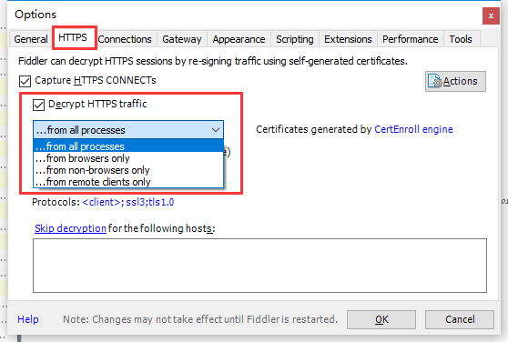
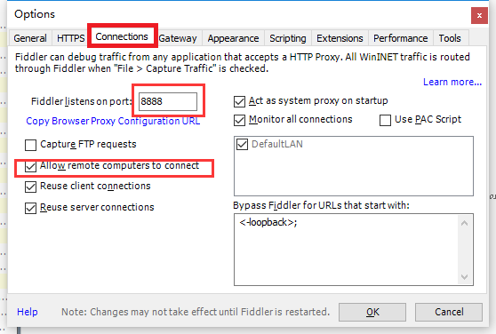
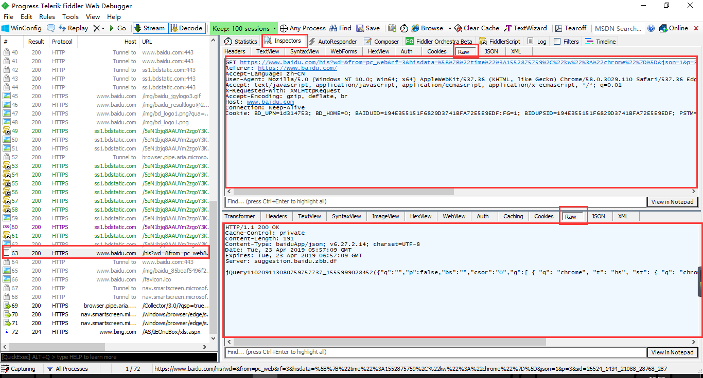
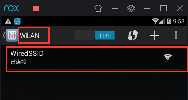
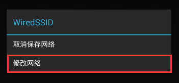
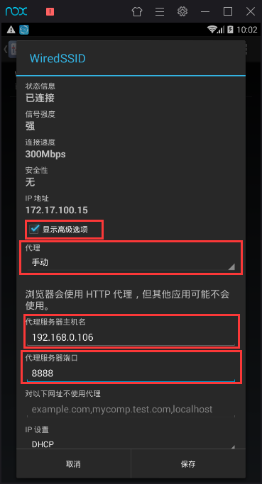
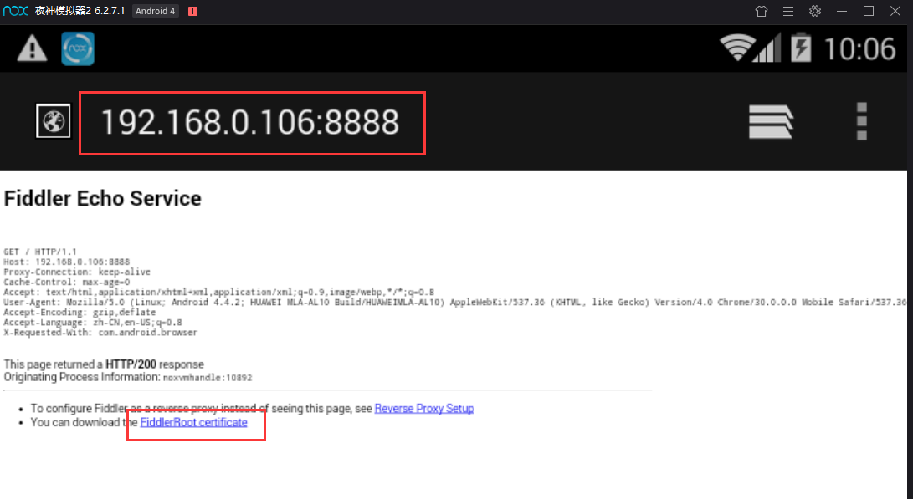
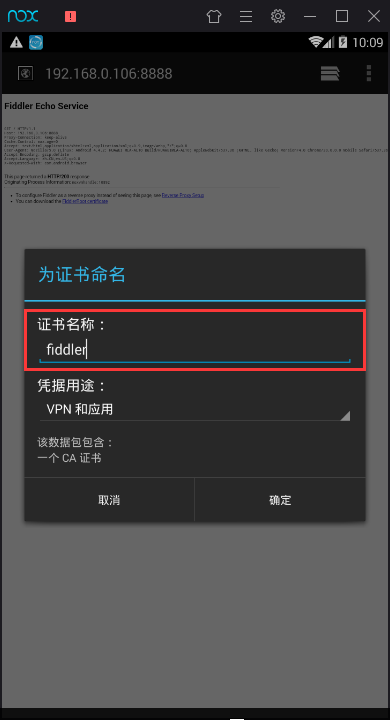

### 2.抓包工具的使用

**Fiddler基础知识**

- Fiddler是强大的抓包工具，它的原理是以web代理服务器的形式进行工作的，使用的代理地址是：127.0.0.1，端口默认为8888，我们也可以通过设置进行修改。
- 代理就是在客户端和服务器之间设置一道关卡，客户端先将请求数据发送出去后，代理服务器会将数据包进行拦截，代理服务器再冒充客户端发送数据到服务器；同理，服务器将响应数据返回，代理服务器也会将数据拦截，再返回给客户端。
- Fiddler可以抓取支持http代理的任意程序的数据包，如果要抓取https会话，要先安装证书。

#### 2.1 Fiddler配置

要使用Fiddler进行抓包，首先需要确保Capture Traffic是开启的（安装后是默认开启的），勾选File->Capture Traffic，也可以直接点击Fiddler界面左下角的图标开启和关闭抓包。开启之后用浏览器访问网页，fiddler中就应该看到抓取到的包了。

**HTTPS的配置：**

点击Tools然后点击Options

点击HTTPS打开https traffic，可以选择监听范围。

点击Connections可以看到监听的端口号，勾选Allow remote computers connect选项。

这样https监听就配置成功了，fiddler可以监听http和https请求。

每个Fiddler抓取到的数据包都会在该列表中展示，点击具体的一条数据包可以在右侧菜单点击Insepector查看详细内容。主要分为请求（即客户端发出的数据）和响应（服务器返回的数据）两部分。

#### 2.2 模拟器配置

##### 2.2.1 代理配置

打开模拟器，进入设置，点击WLAN后进入如下界面。

然后长按WiredSSID这个选项，再点击修改网络。 

勾选显示高级选项，代理选择手动，输入代理ip，即本机ip，端口修改为fiddler设置的端口，然后保存，这样模拟器的数据请求就能被fiddler检测了。

##### 2.2.2 证书安装

打开模拟器里的浏览器，输入配置的ip加端口，出现如下界面，点击FiddlerRoot certificate进行证书安装。证书名字随便输入，比如fiddler，然后点击确定，证书就安装好了。

