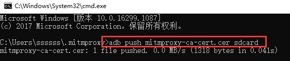
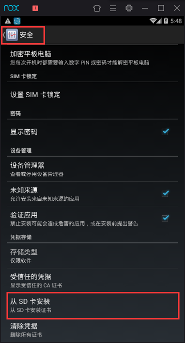
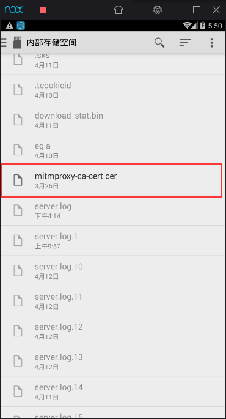
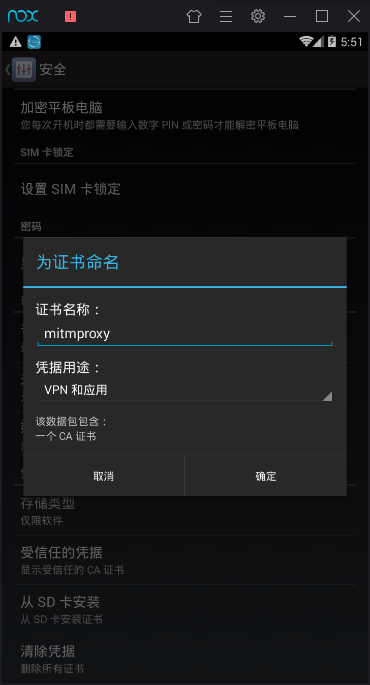
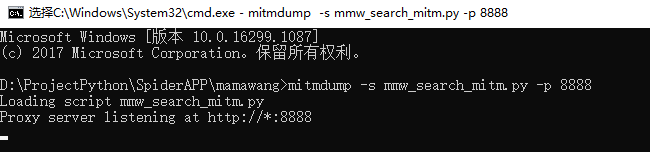

### 4.利用mitmproxy抓取存储数据

#### 4.1 基本原理

mitmproxy还有两个关联组件。一个是mitmdump，它是mitmproxy的命令行接口，利用它我们可以对接Python脚本，用Python实现监听后的处理。另一个是mitmweb，它是一个Web程序，通过它我们可以清楚观察mitmproxy捕获的请求。

手机和PC在同一个局域网内，设置代理为mitmproxy的代理地址，这样手机在访问互联网的时候流量数据包就会流经mitmproxy，mitmproxy再去转发这些数据包到真实的服务器，服务器返回数据包时再由mitmproxy转发回手机，这样mitmproxy就相当于起了中间人的作用，抓取到所有Request和Response，另外这个过程还可以对接mitmdump，抓取到的Request和Response的具体内容都可以直接用Python来处理，比如得到Response之后我们可以直接进行解析，然后存入数据库，这样就完成了数据的解析和存储过程。

由于windows不支持mitmproxy，所以使用mitmdump来处理数据。

mitmdump是mitmproxy的命令行接口，同时还可以对接Python对请求进行处理，这是相比Fiddler、Charles等工具更加方便的地方。有了它我们可以不用手动截获和分析HTTP请求和响应，只需写好请求和响应的处理逻辑即可。它还可以实现数据的解析、存储等工作，这些过程都可以通过Python实现。


**证书安装：**

对于https，在前面讲了windows端证书的安装，模拟器也同样需要安装证书。

将mitmproxy-ca-cert.pem文件传到模拟器的sdcard：



然后打开模拟器设置，点击安全选项，再点击从SD卡安装选项进行安装。



找到push到sdcard的mitmproxy-ca-cert.cer文件，点击。



输入证书名称比如mitmproxy点击确定完成安装。




#### 4.2 抓取步骤

appium实现模拟滑动，不断的加载数据，可以通过fiddler分析的请求地址用mitmdump拦截，获取数据。

如下示例，拦截数据请求返回的response数据，保存到MySQL数据库。

```python
import json
import pymysql

host = '127.0.0.1'
user = 'root'
psd = '123456'
db = 'db'
c = 'utf8'
port = 3306
TABLE_NAME = 'table'


def response(flow):
    # 根据fiddler抓包分析到的数据请求，进行数据处理
    if 'papi.mama.cn/api/search/searchAll' in flow.request.url:
        # 解析返回的json数据
        if 'list' in json.loads(flow.response.text)['data']:
            for item in json.loads(flow.response.text)['data']['list']:
                print(item['pj_title'])
                process_item(item)


# 把数据保存到数据库
def process_item(item):
    con = pymysql.connect(host=host, user=user, passwd=psd, db=db, charset=c, port=port)
    cue = con.cursor()
    try:
        cue.execute("insert ignore into " +
                    TABLE_NAME +
                    "(author, answers, pj_url, authorid, answer_authorid_itt, pj_name, pj_id, pj_title, pj_description) "
                    "values (%s,%s,%s,%s,%s,%s,%s,%s,%s)",
                    [item['author'], item['answers'], item['pj_url'], item['authorid'],
                     item['answer_authorid_itt'], item['pj_name'], item['pj_id'],
                     item['pj_title'], item['pj_description']])
    except Exception as e:
        print('Insert error:', e)
        con.rollback()
    else:
        con.commit()
    con.close()
```

然后通过如下命令运行，其中py_name是python文件名称，8888是检测端口号，要和模拟器配置的代理的端口号一致。

```
mitmdump -s py_name.py -p 8888
```




