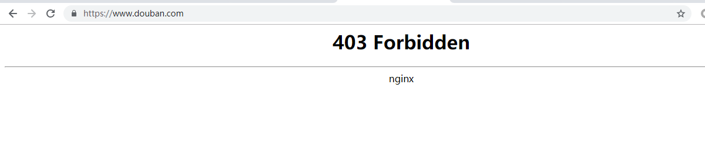
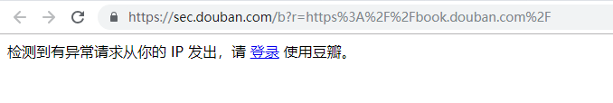

# Python网络爬虫

### 网络爬虫简介：

爬虫：**请求**网站并**提取**数据的**自动化**程序。

通过爬虫获取数据，是大数据数据来源的一个重要方式。

爬虫场景：

- 最基本HTML页面的爬取：只需请求页面url得到页面的HTML源码，通过解析页面得到数据。
- Ajax数据爬取：现在许多网页出于对页面效果的考虑，使用Ajax异步加载数据。这样的网页可以分析页面的Ajax请求，得到请求url和参数模拟进行数据获取。
- 动态渲染页面爬取：有些页面是不能在网页看到真正的HTML，这些HTML可能是通过JavaScript渲染的。爬虫可以通过模拟浏览器登录来进行获取。
- 模拟登录：有些网站必须通过登录才能获取数据，爬虫就必须模拟登录后才有可能得到想要的数据。
- 代理的使用：很多网站都有反爬措施，一个ip大量获取数据可能会被封，需要使用大量代理ip进行隐藏。
- APP的爬取：移动端的信息只能在手机上看到，爬虫必须模拟手机的操作或者破解数据请求方式才有可能获取相应数据。


## 一、网页端爬虫

### 1.环境安装

#### 1.1 python环境

通过Anaconda安装python环境，Anaconda是Python的包管理器和环境管理器，附带了一大批常用数据科学包。

Anaconda下载地址：https://repo.anaconda.com/archive/ ，找到对应系统版本下载，推荐使用python3.6版本。

参考安装教程：https://blog.csdn.net/ITLearnHall/article/details/81708148

#### 1.2 Selenium安装

Selenium是一个浏览器自动化测试框架，Selenium测试直接运行在浏览器中，就像真正的用户在操作一样。框架底层使用JavaScript模拟真实用户对浏览器进行操作。对于爬虫来说，有些页面是通过Ajax动态获取数据的，所以可以通过selenium加载动态页面，以便获取页面数据。

使用selenium需要下载对应浏览器版本的驱动，对于chrome浏览器，需要下载chromedriver。

chromedriver下载地址（主要浏览器版本）：http://npm.taobao.org/mirrors/chromedriver/

下载完成后需要将chromedriver.exe配置到环境变量，可以直接将chromedriver.exe放到anaconda安装目录，因为anaconda环境变量如果是配置好的，把chromedriver.exe放在路径下便能找到。

#### 1.3 python相关包

网页请求获取：urllib,requests

js渲染：selenium（chromedriver），phantomjs（命令行JavaScript）

解析页面：re（正则），lxml，beautifulsoup4，puquery（jquery解析库）

数据库：pymysql，pymongo，redis（分布式，爬取队列）

web：flask，django

#### 1.4 数据库安装MySQL、MongoDB、Redis

略

#### 1.5注意

pip版本如果不是最新，通过pip升级pip出错，则通过下载pip源码进行安装。下载地址：https://pypi.org/project/pip/#files

解压后通过命令：`python setup.py install`进行安装。


### 2.基本库的使用

#### 2.1 爬虫基本原理

在浏览网页的过程中，输入网址之后，经过DNS服务器，找到服务器主机，向服务器发出一个请求，服务器经过解析之后，发送给用户的浏览器 HTML、JS、CSS 等文件，浏览器解析出来，用户便可以看到形形色色的网页了。因此，用户看到的网页实质是由 HTML 代码构成的，爬虫爬来的便是这些内容，通过分析和过滤这些 HTML 代码，实现对图片、文字等资源的获取。

**URL**，即统一资源定位符，也就是我们说的网址，统一资源定位符是对可以从互联网上得到的资源的位置和访问方法的一种简洁的表示，是互联网上标准资源的地址。互联网上的每个文件都有一个唯一的URL，它包含的信息指出文件的位置以及浏览器应该怎么处理它。

> URL的格式由三部分组成：
> ①第一部分是协议(或称为服务方式)。
> ②第二部分是存有该资源的主机IP地址(有时也包括端口号)。
> ③第三部分是主机资源的具体地址，如目录和文件名等。

爬虫爬取数据时必须要有一个目标的URL才可以获取数据，因此，它是爬虫获取数据的基本依据，准确理解它的含义对爬虫学习有很大帮助。

#### 2.2 Urllib库基本使用

Urllib是一个python内置的HTTP请求库。

##### 2.2.1 基本方法：

```python
# url:  需要打开的网址
# data：Post提交的数据
# timeout：设置网站的访问超时时间
urllib.request.urlopen(url, data=None, [timeout, ]*, cafile=None, capath=None, cadefault=False, context=None)
```

直接用urllib.request模块的urlopen()获取页面，page的数据格式为bytes类型，需要decode()解码，转换成str类型。

```python
import urllib
response = urllib.request.urlopen("http://www.baidu.com")
page = response.read()
page = page.decode('utf-8')
```

**urlopen返回对象提供方法：**

- read() , readline() ,readlines() , fileno() , close() ：对HTTPResponse类型数据进行操作
- info()：返回HTTPMessage对象，表示远程服务器返回的头信息
- getcode()：返回Http状态码。如果是http请求，200请求成功完成;404网址未找到
- geturl()：返回请求的url

##### 2.2.2 使用Request
```python
urllib.request.Request(url, data=None, headers={}, method=None)
```

使用request（）来包装请求，再通过urlopen（）获取页面。

```python
from urllib import request
url = r'http://www.lagou.com/zhaopin/Python/?labelWords=label'
headers = {
    'User-Agent': r'Mozilla/5.0 (Windows NT 6.1; WOW64) AppleWebKit/537.36 (KHTML, like Gecko) '
                  r'Chrome/45.0.2454.85 Safari/537.36 115Browser/6.0.3',
    'Referer': r'http://www.lagou.com/zhaopin/Python/?labelWords=label',
    'Connection': 'keep-alive'
}
req = request.Request(url, headers=headers)
page = request.urlopen(req).read()
page = page.decode('utf-8')
```

**用来包装头部的数据：**

- User-Agent ：这个头部可以携带如下几条信息：浏览器名和版本号、操作系统名和版本号、默认语言
- Referer：可以用来防止盗链，有一些网站图片显示来源http://***.com，就是检查Referer来鉴定的
- Connection：表示连接状态，记录Session的状态。

##### 2.2.3 Post请求
urlopen()的data参数默认为None，当data参数不为空的时候，urlopen()提交方式为Post。

```python
url = 'http://httpbin.org/post'
data = {
    'first': 'true',
    'pn': 1,
    'kd': 'Python'
}
data = parse.urlencode(data).encode('utf-8')
req = request.Request(url, data=data)
page = request.urlopen(req).read()
page = page.decode('utf-8')
```

urlencode()主要作用就是将url附上要提交的数据。 Post的数据必须是bytes或者iterable of bytes，不能是str，因此需要进行encode()编码。

##### 2.2.4 使用代理

```python
urllib.request.ProxyHandler(proxies=None)
```

当需要抓取的网站设置了访问限制，这时就需要用到代理来抓取数据。

```python
data = {
    'first': 'true',
    'pn': 1,
    'kd': 'Python'
}
proxy = request.ProxyHandler({'http': 'ip:port'})  # 设置proxy
opener = request.build_opener(proxy)  # 挂载opener
request.install_opener(opener)  # 安装opener
data = parse.urlencode(data).encode('utf-8')
page = opener.open(url, data).read()
page = page.decode('utf-8')
print(page)
```

##### 2.2.5 小结

urllib提供的功能就是利用程序去执行各种HTTP请求。如果要模拟浏览器完成特定功能，需要把请求伪装成浏览器。伪装的方法是先监控浏览器发出的请求，再根据浏览器的请求头来伪装，`User-Agent`头就是用来标识浏览器的。


#### 2.3 Requests库基本使用

安装：`pip install requests` （anaconda已经自带）

```python
import json
import requests

# 1.get请求
payload = {'key1': 'value1', 'key2': 'value2'}
headers = {'content-type': 'application/json'}
r = requests.get("http://httpbin.org/get", params=payload, headers=headers)
print(r.text)
# 如果返回的是json数据，可以通过r.json()进行解析
print(r.json())

# 2.post请求
url = 'http://httpbin.org/post'
# 最基本的传参方法可以利用 data 这个参数。
payload = {'key1': 'value1', 'key2': 'value2'}
r = requests.post(url, data=payload)
print(r.text)
# 有时候我们需要传送的信息不是表单形式的，需要我们传JSON格式的数据过去，
# 所以我们可以用json.dumps()方法把表单数据序列化。
payload = {'some': 'data'}
r = requests.post(url, data=json.dumps(payload))
print(r.text)
# 如果想要上传文件，那么直接用 file 参数即可
files = {'file': open('test.txt', 'rb')}
r = requests.post(url, files=files)
print(r.text)
# requests 是支持流式上传的，这允许你发送大的数据流或文件而无需先把它们读入内存。
# 要使用流式上传，仅需为你的请求体提供一个类文件对象即可
with open('massive-body') as f:
    requests.post('http://some.url/streamed', data=f)

# 3.cookies
cookies = r.cookies
# 另外可以利用 cookies 变量来向服务器发送 cookies 信息
requests.get(url, cookies=cookies)

# 4.超时配置
requests.get(url, timeout=0.001)

# 5.会话对象
s = requests.Session()
s.get('http://httpbin.org/cookies/set/sessioncookie/123456789')
r = s.get("http://httpbin.org/cookies")
print(r.text)

# 6.SSL证书验证
# https 开头的网站，Requests可以为HTTPS请求验证SSL证书，就像web浏览器一样。
# 要想检查某个主机的SSL证书，你可以使用 verify 参数
r = requests.get('https://kyfw.12306.cn/otn/', verify=True)
print(r.text)

# 7.代理
# 如果需要使用代理，你可以通过为任意请求方法提供 proxies 参数来配置单个请求
proxies = {
    "https": "http://41.118.132.69:4433"
}
r = requests.post("http://httpbin.org/post", proxies=proxies)
print(r.text)

# 注：http://httpbin.org 是一个用来测试http的网址。
```

其他更多用法参见官方文档。

Requests官方文档：http://docs.python-requests.org/zh_CN/latest/


#### 2.4 Beautiful Soup库基本使用

Beautiful Soup是一个可以从HTML或XML文件中提取数据的Python库

安装：`pip install beautifulsoup4` (anaconda已经自带)

##### 2.4.1 典型用法

```python
from bs4 import BeautifulSoup

html = """
<html><head><title>The Dormouse's story</title></head>
<body>
<p class="title" name="dromouse"><b>The Dormouse's story</b></p>
<p class="story">Once upon a time there were three little sisters; and their names were
<a href="http://example.com/elsie" class="sister" id="link1"><!-- Elsie --></a>,
<a href="http://example.com/lacie" class="sister" id="link2">Lacie</a> and
<a href="http://example.com/tillie" class="sister" id="link3">Tillie</a>;
and they lived at the bottom of a well.</p>
<p class="story">...</p>
"""

# 创建 beautifulsoup 对象
soup = BeautifulSoup(html)
# 打印一下 soup 对象的内容，格式化输出
print(soup.prettify)

# 结构化数据解析
print(soup.title)  # 获取title
print(soup.title.name)  # title标签名称
print(soup.title.string)  # title标签内容
print(soup.title.parent.name)  # 父标签
print(soup.p['class'])  # 属性获取
print(soup.find_all('a'))  # 查找所有标签
print(soup.find(id="link3"))  # 通过id查找
for link in soup.find_all('a'):  # 遍历获取所有a标签
    print(link.get('href'))  # 获取a标签href属性

```

##### 2.4.2 对象的种类

Beautiful Soup将复杂HTML文档转换成一个复杂的树形结构,每个节点都是Python对象,所有对象可以归纳为4种:

- Tag：`Tag` 对象与XML或HTML原生文档中的tag相同（就是 HTML 中的一个个标签）。
  - Name：每个tag都有自己的名字
  - Attributes：一个tag可能有很多个属性
- NavigableString：可以遍历的字符串。得到了标签的内容，要想获取标签内部的文字，用 .string 即可。
- BeautifulSoup：`BeautifulSoup` 对象表示的是一个文档的全部内容.大部分时候,可以把它当作 `Tag` 对象,它支持 [遍历文档树](https://beautifulsoup.readthedocs.io/zh_CN/latest/#id18) 和 [搜索文档树](https://beautifulsoup.readthedocs.io/zh_CN/latest/#id27) 中描述的大部分的方法.
- Comment：`Comment` 对象是一个特殊类型的 `NavigableString` 对象----注释及特殊字符串。

##### 2.4.3 遍历文档树

- 直接子节点：
  - .contents：tag 的 .content 属性可以将tag的子节点以列表的方式输出
  - .children：它返回的不是一个 list，不过我们可以通过遍历获取所有子节点。
- 所有子孙节点：.descendants
- 父节点：.parent
- 全部父节点：.parents
- 兄弟节点：.next_sibling（下一个兄弟节点）  .previous_sibling（上一个兄弟节点）
- 全部兄弟节点：.next_siblings  .previous_siblings
- 前后节点：.next_element  .previous_element。并不是针对于兄弟节点，而是在所有节点，不分层次。
- 所有前后节点：.next_elements  .previous_elements 属性

##### 2.4.4 搜索文档树 find_

对于上面所有层级节点（父、子、兄弟），都有对应的find方法。搜索当前tag的所有tag子节点,并判断是否符合过滤器的条件

​		find_*( name , attrs , recursive , text , **kwargs )

##### 2.4.5 CSS选择器 soup.select()

- 通过标签名查找：soup.select('title')、soup.select('a')

- 通过类名查找：soup.select('.sister') 

- 通过 id 名查找：soup.select('#link1')

- 组合查找：soup.select('p #link1')，多个条件通过空格分开

- 属性查找：soup.select('a[class="sister"]')


其他更多用法参见官方文档。

Beautiful Soup官方文档：https://beautifulsoup.readthedocs.io/zh_CN/latest/


#### 2.5 Xpath和lxml库基本使用

XPath 是一门在 XML 文档中查找信息的语言。XPath 可用来在 XML 文档中对元素和属性进行遍历。

节点关系：父（Parent）、子（Children）、同胞（Sibling）、先辈（Ancestor）、后代（Descendant）。

选取节点：XPath 使用路径表达式在 XML 文档中选取节点。节点是通过沿着路径或者 step 来选取的。


**七种类型的节点：元素、属性、文本、命名空间、处理指令、注释以及文档节点（或称为根节点）。**

##### 2.5.1 基本表达式

| 表达式   | 描述                                                       |
| :------- | :--------------------------------------------------------- |
| nodename | 选取此节点的所有子节点。                                   |
| /        | 从根节点选取。                                             |
| //       | 从匹配选择的当前节点选择文档中的节点，而不考虑它们的位置。 |
| .        | 选取当前节点。                                             |
| ..       | 选取当前节点的父节点。                                     |
| @        | 选取属性。                                                 |

##### 2.5.2 谓语（Predicates）：谓语用来查找某个特定的节点或者包含某个指定的值的节点。谓语被嵌在方括号中。

|             路径表达式             |                             结果                             |
| :--------------------------------: | :----------------------------------------------------------: |
|         /bookstore/book[1]         |        选取属于 bookstore 子元素的第一个 book 元素。         |
|      /bookstore/book[last()]       |       选取属于 bookstore 子元素的最后一个 book 元素。        |
|     /bookstore/book[last()-1]      |      选取属于 bookstore 子元素的倒数第二个 book 元素。       |
|   /bookstore/book[position()<3]    |  选取最前面的两个属于 bookstore 元素的子元素的 book 元素。   |
|           //title[@lang]           |         选取所有拥有名为 lang 的属性的 title 元素。          |
|        //title[@lang=’eng’]        |  选取所有 title 元素，且这些元素拥有值为 eng 的 lang 属性。  |
|    /bookstore/book[price>35.00]    | 选取 bookstore 元素的所有 book 元素，且其中的 price 元素的值须大于 35.00。 |
| /bookstore/book[price>35.00]/title | 选取 bookstore 元素中的 book 元素的所有 title 元素，且其中的 price 元素的值须大于 35.00。 |

##### 2.5.3 选取未知节点:

XPath 通配符可用来选取未知的 XML 元素。

| 通配符 |         描述         |
| :----: | :------------------: |
|   *    |  匹配任何元素节点。  |
|   @*   |  匹配任何属性节点。  |
| node() | 匹配任何类型的节点。 |

##### 2.5.4 选取若干路径:

通过在路径表达式中使用“|”运算符，您可以选取若干个路径。

|            路径表达式            |                             结果                             |
| :------------------------------: | :----------------------------------------------------------: |
|   //book/title \| //book/price   |          选取 book 元素的所有 title 和 price 元素。          |
|        //title \| //price        |            选取文档中的所有 title 和 price 元素。            |
| /bookstore/book/title \| //price | 选取属于 bookstore 元素的 book 元素的所有 title 元素，以及文档中所有的 price 元素。 |

##### 2.5.6 XPath 运算符

|、+、-、*、div（除法）、=、!=、<、<=、>、>=、or、and、mod

##### 2.5.7 lxml用法

```python
from lxml import etree

text = '''
<div>
    <ul>
         <li class="item-0"><a href="link1.html">first item</a></li>
         <li class="item-1"><a href="link2.html">second item</a></li>
         <li class="item-inactive"><a href="link3.html">third item</a></li>
         <li class="item-1"><a href="link4.html">fourth item</a></li>
         <li class="item-0"><a href="link5.html">fifth item</a>
     </ul>
 </div>
'''
html = etree.HTML(text)
result = etree.tostring(html)
print(result)
# xpath
result = html.xpath('//li')
print(result)
print(len(result))
print(type(result))
print(type(result[0]))
# 获取 <li> 标签下 href 为 link1.html 的 <a> 标签
result = html.xpath('//li/a[@href="link1.html"]')
print(result)
# 获取倒数第二个元素的内容
result = html.xpath('//li[last()-1]/a')
print(result[0].text)
# 获取 class 为 item-0 的标签名
result = html.xpath('//*[@class="item-0"]')
print(result[0].tag)
```


#### 2.6 Selenium库基本使用

安装：`pip install selenium`

基本使用

```python
from selenium import webdriver
from selenium.webdriver.common.keys import Keys

driver = webdriver.Chrome()
driver.get("http://www.python.org")
assert "Python" in driver.title
elem = driver.find_element_by_name("q")  # 根据name查找元素
elem.send_keys("pycon")  # 输入内容
elem.send_keys(Keys.RETURN)  # 回车
print(driver.page_source)  # 返回浏览器渲染后页面
```

##### 2.6.1 页面操作

**页面交互：**

Selenium主要用来和页面交互，比如点击，输入等等。那么前提就是要找到页面中的元素。WebDriver提供了各种方法来寻找元素。

例如下面有一个表单输入框：

```html
<input type="text" name="passwd" id="passwd-id" />
```

我们可以这样获取它：

```python
element = driver.find_element_by_id("passwd-id")
element = driver.find_element_by_name("passwd")
element = driver.find_elements_by_tag_name("input")
element = driver.find_element_by_xpath("//input[@id='passwd-id']")
```

find_element返回一个元素，find_elements返回所有符合条件的元素列表。

在用 xpath 的时候还需要注意的是，用`find_element_by_xpath`时如果有多个元素匹配了 xpath，它只会返回第一个匹配的元素。如果没有找到，那么会抛出 NoSuchElementException 的异常。

获取了input元素之后，向文本框输入内容，可以利用下面`send_keys()`方法：

```python
element.clear()  # 清除默认文本
element.send_keys("some text")
```

**下拉选项卡：**

WebDriver 中提供了一个叫 Select 的方法来操作。

```python
from selenium.webdriver.support.ui import Select

select = Select(driver.find_element_by_name('name'))
select.select_by_index(index)
select.select_by_visible_text("text")
select.select_by_value(value)
# 全部取消选择
select = Select(driver.find_element_by_id('id'))
select.deselect_all()
# 获取所有的已选选项
select = Select(driver.find_element_by_xpath("xpath"))
all_selected_options = select.all_selected_options
```

它可以根据索引来选择，可以根据值来选择，可以根据文字来选择，十分方便。

**Cookies处理：**

```python
# 为页面添加Cookies
driver.get("http://www.example.com")
cookie = {'name': 'foo', 'value': 'bar'}
driver.add_cookie(cookie)
# 获取页面Cookies，用法如下
driver.get("http://www.example.com")
driver.get_cookies()
```

##### 2.6.2 元素选取

单个元素选取：

- find_element_by_id
- find_element_by_name
- find_element_by_xpath
- find_element_by_link_text
- find_element_by_partial_link_text
- find_element_by_tag_name
- find_element_by_class_name
- find_element_by_css_selector

多个元素选取：

- find_elements_by_name
- find_elements_by_xpath
- find_elements_by_link_text
- find_elements_by_partial_link_text
- find_elements_by_tag_name
- find_elements_by_class_name
- find_elements_by_css_selector

##### 2.6.3 页面等待

现在的网页越来越多采用了 Ajax 技术，这样程序便不能确定何时某个元素完全加载出来了。这会让元素定位困难而且会提高产生 ElementNotVisibleException 的概率。

所以 Selenium 提供了两种等待方式，一种是隐式等待，一种是显式等待。

隐式等待是等待特定的时间，显式等待是指定某一条件直到这个条件成立时继续执行。

**显式等待**

显式等待指定某个条件，然后设置最长等待时间。如果在这个时间还没有找到元素，那么便会抛出异常了。

```python
from selenium import webdriver
from selenium.webdriver.common.by import By
from selenium.webdriver.support.ui import WebDriverWait
from selenium.webdriver.support import expected_conditions as EC

driver = webdriver.Chrome()
driver.get("http://somedomain/url_that_delays_loading")
try:
    element = WebDriverWait(driver, 10).until(
        EC.presence_of_element_located((By.ID, "myDynamicElement"))
    )
finally:
    driver.quit()
```

**隐式等待**

隐式等待比较简单，就是简单地设置一个等待时间，单位为秒。

```python
driver = webdriver.Chrome()
driver.implicitly_wait(10)  # seconds
driver.get("http://somedomain/url_that_delays_loading")
myDynamicElement = driver.find_element_by_id("myDynamicElement")
```


其他更多用法参见官方文档。

selenium官网：https://www.seleniumhq.org/docs/index.jsp

selenium-python文档：https://selenium-python.readthedocs.io/index.html


#### 2.7 PyQuery库基本使用

安装：`pip install pyquery`

一个和jQuery极像的python包，pyquery 可让你用 jQuery 的语法来对 xml 进行操作。和 jQuery 十分类似。如果利用 lxml，pyquery 对 xml 和 html 的处理将更快。

这个库不是一个可以和 JavaScript交互的代码库，它只是非常像 jQuery API 而已。

##### 2.7.1 初始化

```python
from pyquery import PyQuery as pq
from lxml import etree

# 初始化
# 1）直接字符串
# pq 参数可以直接传入 HTML 代码，doc 现在就相当于 jQuery 里面的 $ 符号了。
doc = pq("<html></html>")
# 2）lxml.etree
# 可以首先用 lxml 的 etree 处理一下代码，这样如果你的 HTML 代码出现一些不完整或者疏漏，
# 都会自动转化为完整清晰结构的 HTML代码。
doc = pq(etree.fromstring("<html></html>"))
# 3）直接传URL
# 就像直接请求了一个网页一样，类似用 urllib2 来直接请求这个链接，得到 HTML 代码。
doc = pq('http://www.baidu.com')
# 4）传文件
# 直接传某个路径的文件名。
doc = pq(filename='hello.html')
```

PyQuery 初始化之后，返回类型是 PyQuery，利用了选择器筛选一次之后，返回结果的类型依然还是 PyQuery，这和 jQuery 如出一辙。 BeautifulSoup 和 XPath 返回的是列表，不能再进行二次筛选的对象。

##### 2.7.2 属性操作

可以完全按照 jQuery 的语法来进行 PyQuery 的操作.

```python
p = pq('<p id="hello" class="hello"></p>')('p')
print(p.attr("id"))
print(p.attr("id", "plop"))
print(p.attr("id", "hello"))

print(p.addClass('beauty'))
print(p.removeClass('hello'))
print(p.css('font-size', '16px'))
print(p.css({'background-color': 'yellow'}))
```

这是一连串的操作，而 p 是一直在原来的结果上变化的。因此执行上述操作之后，p 本身也发生了变化。

##### 2.7.3 DOM操作

```python
p = pq('<p id="hello" class="hello"></p>')('p')
print(p.append(' check out <a href="http://reddit.com/r/python"><span>reddit</span></a>'))
print(p.prepend('Oh yes!'))
d = pq('<div class="wrap"><div id="test"><a href="http://cuiqingcai.com">Germy</a></div></div>')
p.prependTo(d('#test'))
print(p)
print(d)
d.empty()
print(d)
```

##### 2.7.4 遍历

遍历用到 items 方法返回对象列表，或者用 lambda。

```python
doc = pq(filename='hello.html')
lis = doc('li')
for li in lis.items():
    print(li.html())
print(lis.each(lambda e: e))
```


其他更多用法参见官方文档。

pyquery官方文档：https://pythonhosted.org/pyquery/


#### 2.8 正则表达式

暂略。


### 3.scrapy框架的使用

#### 3.1 Scrapy框架的安装

Scrapy是一个十分强大的爬虫框架，依赖的库比较多，至少需要依赖的库有Twisted 、lxml和pyOpenSSL。在不同的平台环境下，它所依赖的库也各不相同，所以在安装之前，最好确保把一些基本库安装好。

通过pip安装：`pip install scrapy`

如果出现如下错误：


这是安装**Twisted导致的这个错误的发生的**，需要从**非官方版本**下载twisted并安装：

https://www.lfd.uci.edu/~gohlke/pythonlibs/#twisted


下载对应版本后，通过pip安装：

```shell
pip install Twisted-19.2.0-cp36-cp36m-win_amd64.whl
```


**Twisted**是用Python实现的基于事件驱动的网络引擎框架，Twisted支持许多常见的传输及应用层协议，包括TCP、UDP、SSL/TLS、HTTP、IMAP、SSH、IRC以及FTP。scrapy是基于twisted实现的。

成功安装twisted后，再通过`pip install scrap`即可成功安装scrapy。


#### 3.2 Scrapy框架基本使用

第一步：创建项目

CMD进入需要放置项目的目录  输入：

```shell
scrapy startproject DoubanBook    # DoubanBook代表项目的名字
```

用pycharm打开可以看到如下目录结构：


第二步：创建一个爬虫

    cd DoubanBook
    scrapy genspider doubanbook book.douban.com

其中doubanbook是爬虫的名字，book.douban.com代表爬虫爬取url。

执行成功后，可以看到spiders目录下新生成的文件：


打开doubanbook.py文件，可以看到scrapy框架生成的基本爬虫模板，里面定义了爬虫的名称，爬取起始url，还有一个需要完善的解析方法。


第三步：实现爬虫

先简单尝试一下把parse方法里的pass去掉，打印网页源码：

```python
def parse(self, response):
    print(response.text)
```

第四步：运行爬虫

通过下面命令运行爬虫：

    scrapy crawl doubanbook     # doubanbook就是第二步创建爬虫时定义的爬虫名称

这时会出现403错误


这是因为豆瓣网站检测了请求是不是由浏览器发起的，不是的话会被拒绝访问，所以要让爬虫模拟浏览器请求。

修改settings.py配置文件，配置请求头：

```python
# Override the default request headers:
DEFAULT_REQUEST_HEADERS = {
    'User-Agent': 'Mozilla/5.0 (Windows NT 6.1; WOW64) AppleWebKit/537.36 (KHTML, like Gecko) Chrome/45.0.2454.85 Safari/537.36 115Browser/6.0.3',
}
```

再次运行爬虫，就能正常打印出网页源码。

scrapy从创建项目到运行爬虫的基本流程就是这样，详细内容在后面具体介绍。


#### 3.3 Scrapy基本原理

scrapy架构如图所示：


- **Scrapy Engine**: scrapy引擎，负责Spiders、ItemPipeline、Downloader、Scheduler中间的通讯，信号、数据传递等等。

- **Scheduler(调度器)**: 它负责接受引擎发送过来的requests请求，并按照一定的方式进行整理排列、入队，等待Scrapy Engine(引擎)来请求时，交给引擎。

- **Downloader（下载器）**：负责下载Scrapy Engine(引擎)发送的所有Requests请求，并将其获取到的Responses交还给Scrapy Engine(引擎)，由引擎交给Spiders来处理，

- **Spiders**：它负责处理所有Responses,从中分析提取数据，获取Item字段需要的数据，并将需要跟进的URL提交给引擎，再次进入Scheduler(调度器)，

- **Item Pipeline**：它负责处理Spiders中获取到的Item，并进行处理，比如去重，持久化存储（存数据库，写入文件，总之就是保存数据用的）

- **Downloader Middlewares（下载中间件）**：可以当作是一个可以自定义扩展下载功能的组件。

- **Spider Middlewares（Spider中间件）**：可以理解为是一个可以自定扩展和操作引擎和Spiders中间‘通信‘的功能组件（比如进入Spiders的Responses;和从Spiders出去的Requests）


根据scrapy框架的架构，建立一个项目之后：

**第一件事情**是在items.py文件中定义一些字段，这些字段用来临时存储你需要保存的数据。方便后面保存数据到其他地方，比如数据库 或者 本地文本之类的。

**第二件事情**在spiders文件夹中编写自己的爬虫。

**第三件事情**在pipelines.py中存储自己的数据。

**第四件事情**，不是非做不可的，settings.py文件 并不是一定要编辑的，只有有需要的时候才会编辑。SpiderMiddleware和DownloaderMiddleware也是在有需要的情况下进行修改。


#### 3.4 Scrapy中items的用法

在items中定义爬取内容，如下所示：

```python
import scrapy

class DoubanbookTagItem(scrapy.Item):
    # define the fields for your item here like:
    # name = scrapy.Field()
    tag_name = scrapy.Field()
    tag_count = scrapy.Field()
    tag_link = scrapy.Field()
```


#### 3.5 Scrapy中spiders的用法

spider中通过解析请求的页面，最后构造一个item并返回。解析可以使用xpath进行解析，也可以使用Beautiful Soup等第三方库解析。

```python
import scrapy
from scrapy import Request
from DoubanBook.items import DoubanbookTagItem

class DoubanbookSpider(scrapy.Spider):
    name = 'doubanbook'
    allowed_domains = ['book.douban.com']
    start_urls = ['http://book.douban.com']

    def parse(self, response):
        # 获得所有热门标签链接
        link_more = response.xpath('//div[@class="aside"]//span[@class="link-more"]//a/@href').extract_first()
        link_more = self.start_urls[0] + link_more
        # 请求热门标签链接，通过parse_tag方法解析
        return Request(link_more, self.parse_tag)

    # 解析豆瓣图书标签
    def parse_tag(self, response):
        # getall()获取所有标签链接，返回一个列表
        lst_tag_link = response.xpath('//table[@class="tagCol"]//td//a//@href').getall()
        lst_tag_count = response.xpath('//table[@class="tagCol"]//td//b//text()').getall()
        for tag_link, tag_count in zip(lst_tag_link, lst_tag_count):
            # 标签名称
            tag_name = tag_link.split('/')[-1]
            tag_link = self.start_urls[0] + tag_link
            # 返回item
            item = DoubanbookTagItem()
            item['tag_name'] = tag_name
            item['tag_count'] = tag_count
            item['tag_link'] = tag_link
            yield item
```


#### 3.6 Scrapy中Item Pipeline的用法

页面解析后得到item之后，通过item pipeline进行后处理，一般是存入数据库或写入文件。

把数据存入数据库，需要使用到pymysql、pymongo等操作数据库的第三方库,通过pip安装：

	pip install pymysql
	pip install pymongo

下面通过MySQL演示具体使用：

```python
import pymysql
from DoubanBook.items import DoubanbookTagItem


class DoubanbookPipeline(object):
    # 数据库链接配置
    host = '127.0.0.1'
    port = 3306
    user = 'root'
    psd = '123456'
    db = 'spiders'
    tb = 'doubanbook'

    # 处理item
    def process_item(self, item, spider):
        # 判断具体的item，当有多个item的时候好区分
        if isinstance(item, DoubanbookTagItem):
            # 链接数据库
            con = pymysql.connect(host=self.host, user=self.user, passwd=self.psd, db=self.db,
                                  charset=self.c, port=self.port)
            cue = con.cursor()
            # 尝试插入数据库，捕获异常
            try:
                cue.execute("insert ignore into " + self.tb +
                            " (tag_name, tag_count, tag_link) "
                            "values (%s,%s,%s)",
                            [item['tag_name'], item['tag_count'], item['tag_link']])
            except Exception as e:
                print('Insert error:', e)
                con.rollback()
            else:
                # 提交事务
                con.commit()
            # 关闭数据库链接
            con.close()
            return item
```


#### 3.7 Scrapy中Middlewares的用法

暂略。


### 4.使用scrapy-redis实现分布式爬虫

Scrapy 是一个通用的爬虫框架，但是不支持分布式，Scrapy-redis是为了更方便地实现Scrapy分布式爬取，而提供了一些以redis为基础的组件。

#### 4.1 scrapy-redis安装

需要安装reids和scrapy_redis库。

```
pip install redis
pip install scrapy_redis
```


#### 4.2 scrapy-redis基本原理


Scrapy-Redis分布式策略：

- `Master端`(核心服务器) ：搭建一个Redis数据库，负责**url指纹判重、Request的分配，以及数据的存储**
- `Slaver端`(爬虫程序执行端) ：负责执行爬虫程序，运行过程中提交新的Request给Master


1. Scrapy-Reids 就是将Scrapy原本在内存中处理的 调度(就是一个队列Queue)、去重这两个操作通过Redis来实现。
2. 多个Scrapy在采集同一个站点时会使用相同的redis key（可以理解为队列）添加Request 获取Request 去重Request，这样所有的spider不会进行重复采集。
3. Redis是原子性的，一个Request要么被处理 要么没被处理，不存在第三可能。


#### 4.3 scrapy-redis实例


### 5.反爬措施

代码还没敲完就被封的豆瓣。






#### 5.1 代理ip的使用

#### 5.2 cookies池的使用


## 二、APP端爬虫

### 1.环境安装

#### 1.1 模拟器安装

借助模拟器可以方便的进行调试开发APP，下载安装即可。

夜神模拟器：https://www.yeshen.com/

网易MuMu模拟器：http://mumu.163.com/


#### 1.2 SDK安装

下载地址：

（1）官网下载(需翻墙)：https://developer.android.com/studio/index.html 

（2）无需翻墙下载：http://www.androiddevtools.cn/


运行安装，得到如下目录：


打开SDK Manager.exe

**配置国内的镜像服务器地址**

Android SDK Manager的主界面如下，从中可以看到许多的下载项，而该Android SDK Manager默认的下载项地址指向的是安卓官网的下载地址，在这种情况下，我们下载会出现及其卡顿的情况，甚至无法加载资源！所以说我们一般将其改成国内的下载源地址，修改方法如下，点击图示中的【Tools】，在弹出的下拉选项中选择【Options】


    上海GDG镜像服务器
    sdk.gdgshanghai.com   端口：8000 
    大连东软信息学院镜像服务器地址
    IPV4/IPV6：http://mirrors.neusoft.edu.cn  端口：80

在配置好镜像服务器地址之后，再勾选图示中的“Force …”选项，然后点击【close】


**选择要安装的工具**

并不是每一个软件都需要下载，而是有选择的，默认的情况下，该Android SDK Manager会包含以下三个下载项：

    Android SDK Tools
    Android SDK Platform-tools
    Android SDK Build-tools

其中Build-tools是安卓SDK的构建工具，最少我们应该选择一个，其中该软件默认选择的是最新版的，当然我们在这里也可以同时选择多个。


然后选择一个Android版本下载，而在选择所要下载的Android版本时，推荐选择下载与Build-tools对应的版本。

比如：


然后勾选Extras中的选项：


勾选完之后，直接点击【Install】选项安装。

注意：安装时间较长，可能持续数小时。


**配置环境变量**

ANDROID_HOME：配置sdk安装目录


把%ANDROID_SDK_HOME%\platform-tools;%ANDROID_SDK_HOME%\tools添加到Path环境变量中。


**检测是否安装成功**

cmd中输入adb：


#### 1.3 Fiddler安装

Fiddler是一个http协议调试代理工具，它能够记录并检查所有你的电脑和互联网之间的http通讯，设置断点，查看所有的“进出”Fiddler的数据。 Fiddler 要比其他的网络调试器要更加简单，因为它不仅仅暴露http通讯还提供了一个用户友好的格式。

直接从官网下载安装：https://www.telerik.com/download/fiddler


#### 1.4 Appium安装

appium 是一个自动化测试开源工具，支持 iOS 平台和 Android 平台上的原生应用，web应用和混合应用。

appium类库封装了标准Selenium客户端类库，为用户提供所有常见的JSON格式selenium命令以及额外的移动设备控制相关的命令，如多点触控手势和屏幕朝向。

appium是跨平台的，可以用在OSX，Windows以及Linux桌面系统上运行。

appium选择了Client/Server的设计模式。只要client能够发送http请求给server，那么的话client用什么语言来实现都是可以的，这就是appium及Selenium(WebDriver)如何做到支持多语言的原因。


直接从官网下载安装：http://appium.io/


#### 1.5 mitmproxy库的安装

mitmproxy是一个支持HTTP和HTTPS的抓包程序，类似Fiddler、Charles的功能，只不过它通过控制台的形式操作。

此外，mitmproxy还有两个关联组件，一个是mitmdump，它是mitmproxy的命令行接口，利用它可以对接Python脚本，实现监听后的处理；另一个是mitmweb，它是一个Web程序，通过它以清楚地观察到mitmproxy捕获的请求。


安装：

	pip install mitmproxy

通过pip方式可能会报错，建议通过下载whl文件方式进行安装。

下载地址：https://pypi.org/project/mitmproxy/#files

	pip install mitmproxy-4.0.4-py3-none-any.whl


**证书配置**

对于mitmproxy来说，如果想要截获HTTPS请求，就需要设置证书。mitmproxy在安装后会提供一套CA证书，只要客户端信任了mitmproxy提供的证书，就可以通过mitmproxy获取HTTPS请求的具体内容，否则mitmproxy是无法解析HTTPS请求的。

首先，运行`mitmdump`命令产生CA证书。


接下来，我们就可以在用户目录下的.mitmproxy目录里面找到CA证书


其中mitmproxy-ca.p12是用于windows的证书，双击即可出现证书导入页面，点击下一步即可完成安装。

mitmproxy-ca-cert.pem是用于手机端的安装，具体步骤后面介绍。


### 2.抓包工具的使用

**Fiddler基础知识**

- Fiddler是强大的抓包工具，它的原理是以web代理服务器的形式进行工作的，使用的代理地址是：127.0.0.1，端口默认为8888，我们也可以通过设置进行修改。
- 代理就是在客户端和服务器之间设置一道关卡，客户端先将请求数据发送出去后，代理服务器会将数据包进行拦截，代理服务器再冒充客户端发送数据到服务器；同理，服务器将响应数据返回，代理服务器也会将数据拦截，再返回给客户端。
- Fiddler可以抓取支持http代理的任意程序的数据包，如果要抓取https会话，要先安装证书。

#### 2.1 Fiddler配置

要使用Fiddler进行抓包，首先需要确保Capture Traffic是开启的（安装后是默认开启的），勾选File->Capture Traffic，也可以直接点击Fiddler界面左下角的图标开启和关闭抓包。开启之后用浏览器访问网页，fiddler中就应该看到抓取到的包了。


**HTTPS的配置：**

点击Tools然后点击Options


点击HTTPS打开https traffic，可以选择监听范围。


点击Connections可以看到监听的端口号，勾选Allow remote computers connect选项。


这样https监听就配置成功了，fiddler可以监听http和https请求。

每个Fiddler抓取到的数据包都会在该列表中展示，点击具体的一条数据包可以在右侧菜单点击Insepector查看详细内容。主要分为请求（即客户端发出的数据）和响应（服务器返回的数据）两部分。


#### 2.2 模拟器配置

##### 2.2.1 代理配置

打开模拟器，进入设置，点击WLAN后进入如下界面。


然后长按WiredSSID这个选项，再点击修改网络。 


勾选显示高级选项，代理选择手动，输入代理ip，即本机ip，端口修改为fiddler设置的端口，然后保存，这样模拟器的数据请求就能被fiddler检测了。


##### 2.2.2 证书安装

打开模拟器里的浏览器，输入配置的ip加端口，出现如下界面，点击FiddlerRoot certificate进行证书安装。证书名字随便输入，比如fiddler，然后点击确定，证书就安装好了。


### 3.移动端自动化控制

#### 3.1 APK包名获取

通过adb方式来获取apk包名。首先确保adb服务已经启动并且连接上了模拟器。

启动adb服务：

	adb start-server

通过adb devices方式查看连接上的模拟器。如果输入adb devices没有已连接的设备，则需要通过手动连接。

	adb connect 127.0.0.1:62001

##### 端口号查看

打开任务管理器详细信息，找到模拟器的PID，如下图是夜神模拟器的运行PID。


然后通过`netstat -ano`命令找到对应端口。夜神模拟器的默认端口从62001开始，后面都是从62025开始


确认adb连接上设备之后，输入

    adb shell
命令启动adb shell，然后输入如下命令：

	logcat | grep cmp=

然后在模拟器中打开想要获取包名的app,就可以看到app的包名和页面的Activity了。


#### 3.2 Appium使用

appium的python包通过如下命令安装：

	pip install Appium-Python-Client 

启动appium的服务


操作示例代码：

```python
import time
from appium import webdriver
from selenium.webdriver.support.ui import WebDriverWait

# 连接配置
cap = {
    "platformName": "Android",
    "platformVersion": "4.4.2",
    "deviceName": "127.0.0.1:62026",
    "appPackage": "cn.mama.pregnant",
    "appActivity": "cn.mama.pregnant.activity.HomeActivity",
    "noReset": True,
    "resetKeyboard": True,
    "unicodeKeyboard": True  # 中文支持！！！
}


# 获取屏幕大小
def get_size():
    x = driver.get_window_size()['width']
    y = driver.get_window_size()['height']
    return (x, y)


KEY_WORD = '纸尿裤'
print('APP启动中...')
# 启动连接
driver = webdriver.Remote("http://localhost:4723/wd/hub", cap)

l = get_size()
x1 = int(l[0] * 0.6)
y1 = int(l[1] * 0.9)
y2 = int(l[1] * 0.3)

# XPATH
XPATH_SEARCH = "//android.widget.TextView[@resource-id='cn.mama.pregnant:id/text_search_actionBar']"
WebDriverWait(driver, 10).until(lambda x: x.find_element_by_xpath(XPATH_SEARCH))  # 等待10s页面加载完成
driver.find_element_by_xpath(XPATH_SEARCH).click()  # 点击
XPATH_SEARCH_IN = "//android.widget.EditText[@resource-id='cn.mama.pregnant:id/input']"
WebDriverWait(driver, 2).until(lambda x: x.find_element_by_xpath(XPATH_SEARCH_IN))
driver.find_element_by_xpath(XPATH_SEARCH_IN).send_keys(KEY_WORD)  # 输入文字
time.sleep(1)
# enter搜索
driver.keyevent(66)

time.sleep(10)
while True:
    driver.swipe(x1, y1, x1, y2)  # 滑动屏幕
    print('滑动屏幕...')
    time.sleep(1)
```

其中Xpath的获取通过sdk的uiautomatorviewer工具获取。

##### uiautomatorviewer的使用


双击即可运行，点击左上角按钮即可获取模拟器页面，点击页面相应组件就可在右边获取到相应的xpath路径。


uiautomatorviewer优化包替换：

##### TODO


注意：appium服务在开启状态下uiautomatorviewer无法获取模拟器界面！


### 4.利用mitmproxy抓取存储数据

#### 4.1 基本原理

mitmproxy还有两个关联组件。一个是mitmdump，它是mitmproxy的命令行接口，利用它我们可以对接Python脚本，用Python实现监听后的处理。另一个是mitmweb，它是一个Web程序，通过它我们可以清楚观察mitmproxy捕获的请求。

手机和PC在同一个局域网内，设置代理为mitmproxy的代理地址，这样手机在访问互联网的时候流量数据包就会流经mitmproxy，mitmproxy再去转发这些数据包到真实的服务器，服务器返回数据包时再由mitmproxy转发回手机，这样mitmproxy就相当于起了中间人的作用，抓取到所有Request和Response，另外这个过程还可以对接mitmdump，抓取到的Request和Response的具体内容都可以直接用Python来处理，比如得到Response之后我们可以直接进行解析，然后存入数据库，这样就完成了数据的解析和存储过程。

由于windows不支持mitmproxy，所以使用mitmdump来处理数据。

mitmdump是mitmproxy的命令行接口，同时还可以对接Python对请求进行处理，这是相比Fiddler、Charles等工具更加方便的地方。有了它我们可以不用手动截获和分析HTTP请求和响应，只需写好请求和响应的处理逻辑即可。它还可以实现数据的解析、存储等工作，这些过程都可以通过Python实现。


**证书安装：**

对于https，在前面讲了windows端证书的安装，模拟器也同样需要安装证书。

将mitmproxy-ca-cert.pem文件传到模拟器的sdcard：


然后打开模拟器设置，点击安全选项，再点击从SD卡安装选项进行安装。


找到push到sdcard的mitmproxy-ca-cert.cer文件，点击。


输入证书名称比如mitmproxy点击确定完成安装。


#### 4.2 抓取步骤

appium实现模拟滑动，不断的加载数据，可以通过fiddler分析的请求地址用mitmdump拦截，获取数据。

```python
import json
import pymysql

host = '127.0.0.1'
user = 'root'
psd = '123456'
db = 'db'
c = 'utf8'
port = 3306
TABLE_NAME = 'table'


def response(flow):
    # 根据fiddler抓包分析到的数据请求，进行数据处理
    if 'papi.mama.cn/api/search/searchAll' in flow.request.url:
        if 'list' in json.loads(flow.response.text)['data']:
            for item in json.loads(flow.response.text)['data']['list']:
                print(item['pj_title'])
                process_item(item)


# 把数据保存到数据库
def process_item(item):
    con = pymysql.connect(host=host, user=user, passwd=psd, db=db, charset=c, port=port)
    cue = con.cursor()
    try:
        cue.execute("insert ignore into " +
                    TABLE_NAME +
                    "(author, answers, pj_url, authorid, answer_authorid_itt, pj_name, pj_id, pj_title, pj_description) "
                    "values (%s,%s,%s,%s,%s,%s,%s,%s,%s)",
                    [item['author'], item['answers'], item['pj_url'], item['authorid'],
                     item['answer_authorid_itt'], item['pj_name'], item['pj_id'],
                     item['pj_title'], item['pj_description']])
    except Exception as e:
        print('Insert error:', e)
        con.rollback()
    else:
        con.commit()
    con.close()
```


### 5.APK脱壳反编译

#### 5.1 脱壳：

https://www.jianshu.com/p/138c9de2c987

工具：VirtualXposed（或者直接xposed）、FDex2

#### 5.2 APK反编译：

https://blog.csdn.net/s13383754499/article/details/78914592

- apktool ：使用apktool反编译apk得到图片、XML配置、语言资源等文件，

```shell
java -jar apktool_2.0.1.jar d -f [PATH_APK] -o [PATH_OUT]
```

- dex2jar：使用dex2jar反编译apk得到Java源代码，将要反编译的APK后缀名改为.rar或者 .zip，并解压，得到其中的classes.dex文件（它就是java文件编译再通过dx工具打包而成的）

```shell
d2j-dex2jar classes.dex
```

- jd-gui ：源码查看，IDEA亦可

#### 5.3 JAD-反编译class文件：

[利用jdk自带的jad.exe实现批量反编译class文件](https://www.cnblogs.com/flydkPocketMagic/p/7048350.html)

```shell
jad -o -8 -r -d[PATH_OUT] -sjava [PATH_CLASS]
```


## References

崔庆才的个人博客：https://cuiqingcai.com/

廖雪峰的官方网站：https://www.liaoxuefeng.com

Urllib模块的使用：https://www.cnblogs.com/Lands-ljk/p/5447127.html

Requests官方文档：http://docs.python-requests.org/zh_CN/latest/

Xpath教程：http://www.w3school.com.cn/xpath/index.asp

selenium官网：https://www.seleniumhq.org/docs/index.jsp

selenium-python文档：https://selenium-python.readthedocs.io/index.html

pyquery官网：https://pythonhosted.org/pyquery/

使用 scrapy-redis实现分布式爬虫：https://blog.csdn.net/lm_is_dc/article/details/81057811

SDK的下载与安装：https://blog.csdn.net/zzy1078689276/article/details/80380118

Fiddler工具使用介绍：https://www.cnblogs.com/miantest/p/7289694.html

App爬虫神器mitmproxy和mitmdump的使用：https://www.jianshu.com/p/b0612fcedfa1