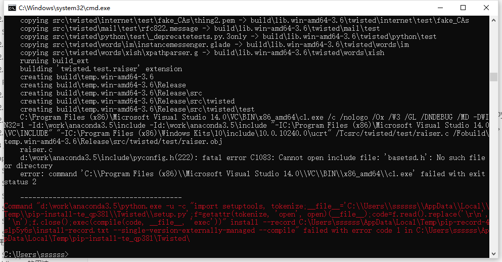
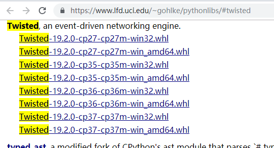
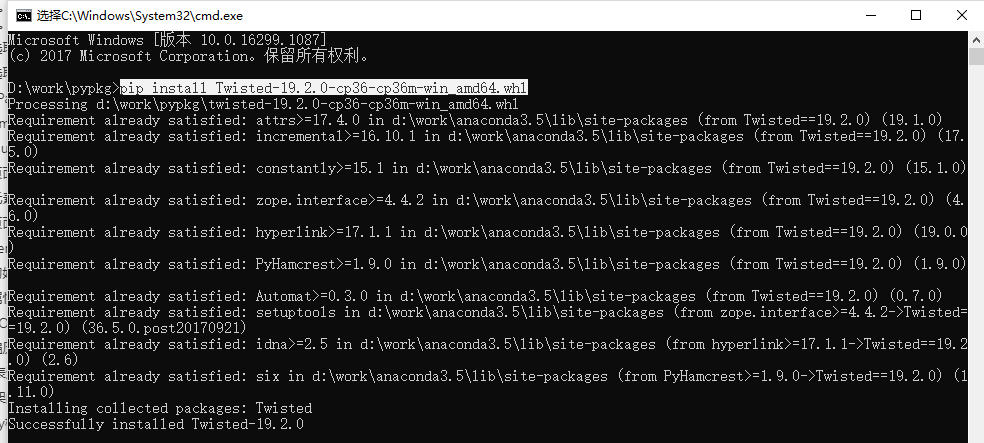
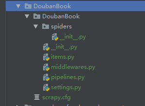
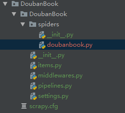
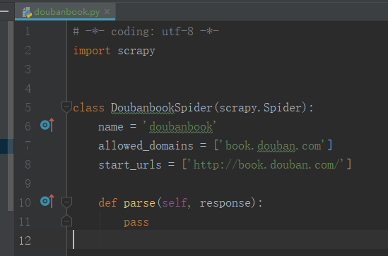
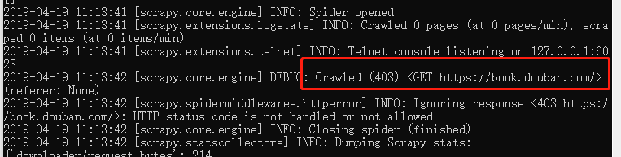

### 3.scrapy框架的使用

#### 3.1 Scrapy框架的安装

Scrapy是一个十分强大的爬虫框架，依赖的库比较多，至少需要依赖的库有Twisted 、lxml和pyOpenSSL。在不同的平台环境下，它所依赖的库也各不相同，所以在安装之前，最好确保把一些基本库安装好。	

通过pip安装：`pip install scrapy`

如果出现如下错误：



这是安装**Twisted导致的这个错误的发生的**，需要从**非官方版本**下载twisted并安装：

https://www.lfd.uci.edu/~gohlke/pythonlibs/#twisted



下载对应版本后，通过pip安装：

```shell
pip install Twisted-19.2.0-cp36-cp36m-win_amd64.whl
```



**Twisted**是用Python实现的基于事件驱动的网络引擎框架，Twisted支持许多常见的传输及应用层协议，包括TCP、UDP、SSL/TLS、HTTP、IMAP、SSH、IRC以及FTP。scrapy是基于twisted实现的。

成功安装twisted后，再通过`pip install scrap`即可成功安装scrapy。


#### 3.2 Scrapy框架基本使用

第一步：创建项目

CMD进入需要放置项目的目录  输入：

```shell
scrapy startproject DoubanBook    # DoubanBook代表项目的名字
```

用pycharm打开可以看到如下目录结构：



第二步：创建一个爬虫

```
cd DoubanBook
scrapy genspider doubanbook book.douban.com
```

其中doubanbook是爬虫的名字，book.douban.com代表爬虫爬取url。

执行成功后，可以看到spiders目录下新生成的文件：



打开doubanbook.py文件，可以看到scrapy框架生成的基本爬虫模板，里面定义了爬虫的名称，爬取起始url，还有一个需要完善的解析方法。



第三步：实现爬虫

先简单尝试一下把parse方法里的pass去掉，打印网页源码：

```python
def parse(self, response):
    print(response.text)
```

第四步：运行爬虫

通过下面命令运行爬虫：

```
scrapy crawl doubanbook     # doubanbook就是第二步创建爬虫时定义的爬虫名称
```

这时会出现403错误



这是因为豆瓣网站检测了请求是不是由浏览器发起的，不是的话会被拒绝访问，所以要让爬虫模拟浏览器请求。

修改settings.py配置文件，配置请求头：

```python
# Override the default request headers:
DEFAULT_REQUEST_HEADERS = {
    'User-Agent': 'Mozilla/5.0 (Windows NT 6.1; WOW64) AppleWebKit/537.36 (KHTML, like Gecko) Chrome/45.0.2454.85 Safari/537.36 115Browser/6.0.3',
}
```

再次运行爬虫，就能正常打印出网页源码。

scrapy从创建项目到运行爬虫的基本流程就是这样，详细内容在后面具体介绍。


#### 3.3 Scrapy基本原理

scrapy架构如图所示：


- **Scrapy Engine**: scrapy引擎，负责Spiders、ItemPipeline、Downloader、Scheduler中间的通讯，信号、数据传递等等。
- **Scheduler(调度器)**: 它负责接受引擎发送过来的requests请求，并按照一定的方式进行整理排列、入队，等待Scrapy Engine(引擎)来请求时，交给引擎。
- **Downloader（下载器）**：负责下载Scrapy Engine(引擎)发送的所有Requests请求，并将其获取到的Responses交还给Scrapy Engine(引擎)，由引擎交给Spiders来处理，
- **Spiders**：它负责处理所有Responses,从中分析提取数据，获取Item字段需要的数据，并将需要跟进的URL提交给引擎，再次进入Scheduler(调度器)，
- **Item Pipeline**：它负责处理Spiders中获取到的Item，并进行处理，比如去重，持久化存储（存数据库，写入文件，总之就是保存数据用的）
- **Downloader Middlewares（下载中间件）**：可以当作是一个可以自定义扩展下载功能的组件。
- **Spider Middlewares（Spider中间件）**：可以理解为是一个可以自定扩展和操作引擎和Spiders中间‘通信‘的功能组件（比如进入Spiders的Responses;和从Spiders出去的Requests）


根据scrapy框架的架构，建立一个项目之后：

**第一件事情**是在items.py文件中定义一些字段，这些字段用来临时存储你需要保存的数据。方便后面保存数据到其他地方，比如数据库 或者 本地文本之类的。

**第二件事情**在spiders文件夹中编写自己的爬虫。

**第三件事情**在pipelines.py中存储自己的数据。

**第四件事情**，不是非做不可的，settings.py文件 并不是一定要编辑的，只有有需要的时候才会编辑。SpiderMiddleware和DownloaderMiddleware也是在有需要的情况下进行修改。


#### 3.4 Scrapy中items的用法

在items中定义爬取内容，如下所示：

```python
import scrapy

class DoubanbookTagItem(scrapy.Item):
    # define the fields for your item here like:
    # name = scrapy.Field()
    tag_name = scrapy.Field()
    tag_count = scrapy.Field()
    tag_link = scrapy.Field()
```


#### 3.5 Scrapy中spiders的用法

spider中通过解析请求的页面，最后构造一个item并返回。解析可以使用xpath进行解析，也可以使用Beautiful Soup等第三方库解析。

```python
import scrapy
from scrapy import Request
from DoubanBook.items import DoubanbookTagItem

class DoubanbookSpider(scrapy.Spider):
    name = 'doubanbook'
    allowed_domains = ['book.douban.com']
    start_urls = ['http://book.douban.com']

    def parse(self, response):
        # 获得所有热门标签链接
        link_more = response.xpath('//div[@class="aside"]//span[@class="link-more"]//a/@href').extract_first()
        link_more = self.start_urls[0] + link_more
        # 请求热门标签链接，通过parse_tag方法解析
        return Request(link_more, self.parse_tag)

    # 解析豆瓣图书标签
    def parse_tag(self, response):
        # getall()获取所有标签链接，返回一个列表
        lst_tag_link = response.xpath('//table[@class="tagCol"]//td//a//@href').getall()
        lst_tag_count = response.xpath('//table[@class="tagCol"]//td//b//text()').getall()
        for tag_link, tag_count in zip(lst_tag_link, lst_tag_count):
            # 标签名称
            tag_name = tag_link.split('/')[-1]
            tag_link = self.start_urls[0] + tag_link
            # 返回item
            item = DoubanbookTagItem()
            item['tag_name'] = tag_name
            item['tag_count'] = tag_count
            item['tag_link'] = tag_link
            yield item
```


#### 3.6 Scrapy中Item Pipeline的用法

页面解析后得到item之后，通过item pipeline进行后处理，一般是存入数据库或写入文件。

把数据存入数据库，需要使用到pymysql、pymongo等操作数据库的第三方库,通过pip安装：

```
pip install pymysql
pip install pymongo
```

下面通过MySQL演示具体使用：

```python
import pymysql
from DoubanBook.items import DoubanbookTagItem


class DoubanbookPipeline(object):
    # 数据库链接配置
    host = '127.0.0.1'
    port = 3306
    user = 'root'
    psd = '123456'
    db = 'spiders'
    tb = 'doubanbook'

    # 处理item
    def process_item(self, item, spider):
        # 判断具体的item，当有多个item的时候好区分
        if isinstance(item, DoubanbookTagItem):
            # 链接数据库
            con = pymysql.connect(host=self.host, user=self.user, passwd=self.psd, db=self.db,
                                  charset=self.c, port=self.port)
            cue = con.cursor()
            # 尝试插入数据库，捕获异常
            try:
                cue.execute("insert ignore into " + self.tb +
                            " (tag_name, tag_count, tag_link) "
                            "values (%s,%s,%s)",
                            [item['tag_name'], item['tag_count'], item['tag_link']])
            except Exception as e:
                print('Insert error:', e)
                con.rollback()
            else:
                # 提交事务
                con.commit()
            # 关闭数据库链接
            con.close()
            return item
```

然后取消settings中的ITEM_PIPELINES注释，数字代表优先级，当有多个item_pipelines的时候起作用。

```python
# Configure item pipelines
# See https://doc.scrapy.org/en/latest/topics/item-pipeline.html
ITEM_PIPELINES = {
   'DoubanBook.pipelines.DoubanbookPipeline': 300,
}
```

这样再执行`scrapy crawl doubanbook`启动爬虫，数据就会保存到数据库中。

