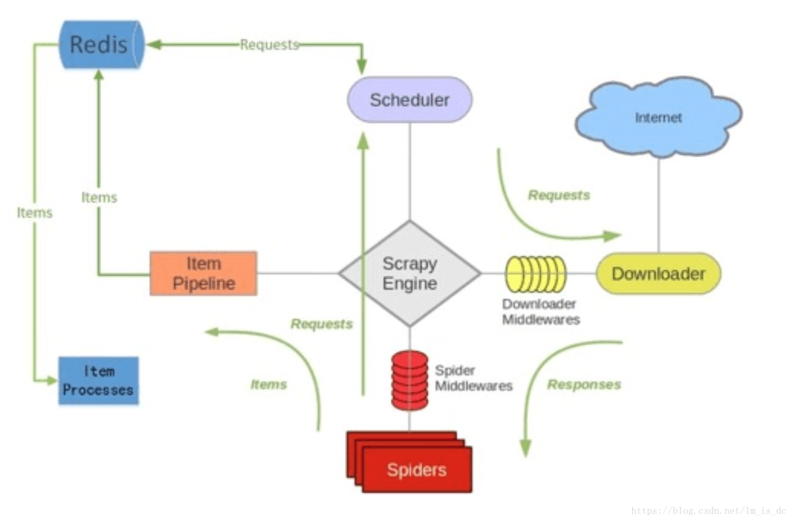

### 4.使用scrapy-redis实现分布式爬虫

Scrapy 是一个通用的爬虫框架，但是不支持分布式，Scrapy-redis是为了更方便地实现Scrapy分布式爬取，而提供了一些以redis为基础的组件。

#### 4.1 scrapy-redis安装

需要安装reids和scrapy_redis库。

```
pip install redis
pip install scrapy_redis

```


#### 4.2 scrapy-redis基本原理



Scrapy-Redis分布式策略：

- `Master端`(核心服务器) ：搭建一个Redis数据库，负责**url指纹判重、Request的分配，以及数据的存储**
- `Slaver端`(爬虫程序执行端) ：负责执行爬虫程序，运行过程中提交新的Request给Master


1. Scrapy-Reids 就是将Scrapy原本在内存中处理的 调度(就是一个队列Queue)、去重这两个操作通过Redis来实现。
2. 多个Scrapy在采集同一个站点时会使用相同的redis key（可以理解为队列）添加Request 获取Request 去重Request，这样所有的spider不会进行重复采集。
3. Redis是原子性的，一个Request要么被处理 要么没被处理，不存在第三可能。


#### 4.3 scrapy-redis实例

##### 4.3.1 items.py

定义两个item，一个是待爬取的每本书的url，一个是每本书的具体内容。

```python
# -*- coding: utf-8 -*-
import scrapy
from scrapy.loader.processors import MapCompose, TakeFirst, Join

def remove_space(value):
    return value.strip()

# 要爬取的每本书的url
class MasterRedisItem(scrapy.Item):
    url = scrapy.Field()

# 要爬取的每一本书的具体内容
class DangdangItem(scrapy.Item):
    collection = 'dangdang'

    name = scrapy.Field()
    author = scrapy.Field()
    price = scrapy.Field(
        input_processor=MapCompose(remove_space),
    )
    crawl_time = scrapy.Field()
    ISBN = scrapy.Field()
    id = scrapy.Field()
```

##### 4.3.2 spiders

实现两个spider，一个用来获取每本书的url，存入redis，框架实现去重，爬取队列等。另一个用来爬取每本书的具体内容，从redis中读取url进行爬取。

master端spider：返回MasterRedisItem

```python
import scrapy
from scrapy import Selector, Request
from urllib import parse
from dangdang.items import MasterRedisItem

class HouseSpider(scrapy.Spider):
    name = 'dangmaster'
    allowed_domains = ['category.dangdang.com', 'book.dangdang.com']
    start_urls = ['http://book.dangdang.com/01.03.htm?ref=book-01-A']

    def parse(self, response):
        url_nodes = response.xpath("//div[@class='con flq_body']/div[@class='level_one ']/dl/dt/a/@href").extract()
        for url_node in url_nodes:
            yield Request(url=parse.urljoin(response.url, url_node), callback=self.parse_list)

    def parse_list(self, response):
        next_url = response.xpath("//li[@class='next']/a/@href").extract_first()

        if next_url:
            yield Request(url=parse.urljoin(response.url, next_url), callback=self.parse_list)

        url_nodes = response.xpath("//div[@class='con shoplist']/div/ul/li/a/@href").extract()
        for url_node in url_nodes:
            item = MasterRedisItem()
            item['url'] = url_node
            yield item
```

client端spider：返回DangdangItem，其中redis_key = 'dangdang:start_urls'，和下面pipelines对应一致。

```python
# -*- coding: utf-8 -*-
from scrapy.spiders import Rule
from scrapy.linkextractors import LinkExtractor
from scrapy_redis.spiders import RedisSpider, RedisCrawlSpider
from dangdang.items import DangdangItem
from datetime import datetime


class Dangdangspider(RedisSpider):
    """Spider that reads urls from redis queue (myspider:start_urls)."""
    name = 'dangdang'
    redis_key = 'dangdang:start_urls'
    allowed_domains = ['book.dangdang.com', 'product.dangdang.com', 'www.dangdang.com']

    def __init__(self, *args, **kwargs):
        # Dynamically define the allowed domains list.
        self.number = 0
        super(Dangdangspider, self).__init__(*args, **kwargs)

    def parse(self, response):
        item = DangdangItem()
        item["name"] = response.xpath("//h1/@title").extract_first()
        item["author"] = response.xpath("//span[@id='author']/a[1]/text()").extract_first()
        item["price"] = response.xpath("//p[@id='dd-price']/text()[2]").extract_first()
        item["ISBN"] = response.xpath("//div[@id='detail_describe']/ul/li[5]/text()").extract_first()
        item["crawl_time"] = datetime.now().strftime("%Y-%m-%d %H:%M:%S")
        self.number = self.number + 1
        item["id"] = self.number
        yield item
```

##### 4.3.3 pipelines.py

处理url的redis缓存和最终数据保存到数据库。

```python
# -*- coding: utf-8 -*-
import pymongo
import pymysql
from scrapy.conf import settings
from dangdang.items import DangdangItem, MasterRedisItem
import redis

class DangdangPipeline(object):
    def process_item(self, item, spider):
        return item

# 把数据存入mongodb
class MongoPipeline(object):
    def __init__(self, uri, dbname, sheetname):
        client = pymongo.MongoClient(uri)
        # 指定数据库
        mydb = client[dbname]
        # 存放数据的数据库表名
        self.post = mydb[sheetname]

    @classmethod
    def from_crawler(cls, crawler):
        return cls(
            uri=crawler.settings.get('MONGO_URI'),
            dbname=crawler.settings.get('DBNAME'),
            sheetname=crawler.settings.get('SHEETNAME')
        )

    def process_item(self, item, spider):
        if isinstance(item, DangdangItem):
            data = dict(item)
            self.post.insert(data)
        return item

# 实现redis对url的缓存作用
class RedisLinJiaPipeline(object):
    def __init__(self, host='localhost', port=6379,
                 db=2, password=None):
        self.host = host
        self.port = port
        self.db = db
        self.password = password

    @classmethod
    def from_crawler(cls, crawler):
        return cls(
            host=crawler.settings.get('REDIS_HOST'),
            port=crawler.settings.get('REDIS_PORT'),
            db=crawler.settings.get('REDIS_DB'),
            password=crawler.settings.get('REDIS_PASSWORD'),
        )

    def open_spider(self, spider):
        self.r = redis.Redis(host=self.host, port=self.port, password=self.password, db=self.db)

    def close_spider(self, spider):
        pass

    def process_item(self, item, spider):
        if isinstance(item, MasterRedisItem):
            self.r.lpush('dangdang:start_urls', item['url'])
        return item
```

##### 4.3.4 middlewares.py

```python
# -*- coding: utf-8 -*-
from scrapy import signals
from fake_useragent import UserAgent

class DangdangDownloaderMiddleware(object):
    # Not all methods need to be defined. If a method is not defined,
    # scrapy acts as if the downloader middleware does not modify the
    # passed objects.

    @classmethod
    def from_crawler(cls, crawler):
        # This method is used by Scrapy to create your spiders.
        s = cls()
        crawler.signals.connect(s.spider_opened, signal=signals.spider_opened)
        return s

    def process_request(self, request, spider):
        # Called for each request that goes through the downloader
        # middleware.

        # Must either:
        # - return None: continue processing this request
        # - or return a Response object
        # - or return a Request object
        # - or raise IgnoreRequest: process_exception() methods of
        #   installed downloader middleware will be called
        return None

    def process_response(self, request, response, spider):
        # Called with the response returned from the downloader.

        # Must either;
        # - return a Response object
        # - return a Request object
        # - or raise IgnoreRequest
        return response

    def process_exception(self, request, exception, spider):
        # Called when a download handler or a process_request()
        # (from other downloader middleware) raises an exception.

        # Must either:
        # - return None: continue processing this exception
        # - return a Response object: stops process_exception() chain
        # - return a Request object: stops process_exception() chain
        pass

    def spider_opened(self, spider):
        spider.logger.info('Spider opened: %s' % spider.name)

# 生成随机的UserAgent
class RandomUserAgentMiddleware(object):
    def __init__(self, crawler):
        super(RandomUserAgentMiddleware, self).__init__()
        # self.user_agent_list = crawler.settings.get("user_agent_list",[])
        self.ua = UserAgent()
        self.ua_type = crawler.settings.get("RANDOM_UA_TYPE", "random")

    @classmethod
    def from_crawler(cls, crawler):
        return cls(crawler)

    def process_request(self, request, spider):
        def get_ua():
            return getattr(self.ua, self.ua_type)

        random_agent = get_ua()
        request.headers.setdefault("User-Agent", random_agent)
```

##### 4.3.5 settings.py

```python
# -*- coding: utf-8 -*-
# Scrapy settings for dangdang project

BOT_NAME = 'dangdang'
SPIDER_MODULES = ['dangdang.spiders']
NEWSPIDER_MODULE = 'dangdang.spiders'

# Obey robots.txt rules
ROBOTSTXT_OBEY = False
DUPEFILTER_CLASS = "scrapy_redis.dupefilter.RFPDupeFilter"
SCHEDULER = "scrapy_redis.scheduler.Scheduler"

# Disable cookies (enabled by default)
COOKIES_ENABLED = False

# Enable or disable downloader middlewares
# See https://doc.scrapy.org/en/latest/topics/downloader-middleware.html
DOWNLOADER_MIDDLEWARES = {
    'dangdang.middlewares.RandomUserAgentMiddleware': 100,
    'dangdang.middlewares.DangdangDownloaderMiddleware': 200,
}

# Configure item pipelines
# See https://doc.scrapy.org/en/latest/topics/item-pipeline.html
ITEM_PIPELINES = {
    'dangdang.pipelines.RedisLinJiaPipeline': 300,
    'dangdang.pipelines.MongoPipeline': 200,
}

# mongodb数据库配置
MONGO_URI = "mongodb://localhost/dangdang"
DBNAME = "dangdang"
SHEETNAME = "dangdang"
# redis数据库配置
REDIS_HOST = "127.0.0.1"
REDIS_PORT = "6379"
REDIS_PASSWORD = ""
```


运行master端开始获取url存入redis，client端可以开启多个同时进行爬取，这样就实现了spider的并行。

```shell
scrapy crawl dangmaster # 开启一个
scrapy crawl dangdang # 可以开启多个
```


